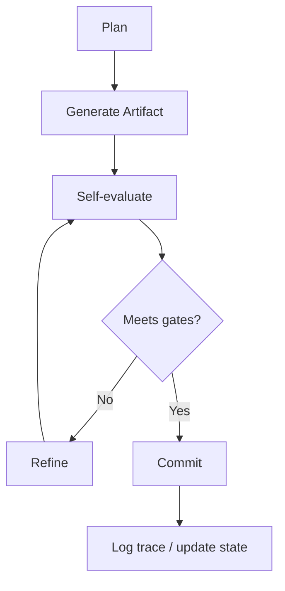
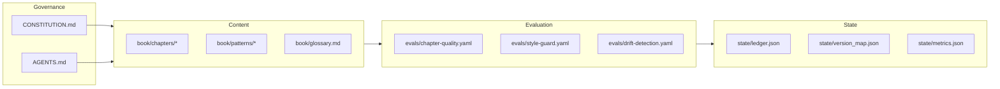

# AI-First Software Engineering

This repository is a technical book and a working research artifact.
The book is developed via an autonomous edit loop operating inside a Git repository under explicit governance and evaluation rules.
Its state-runner objective is to use the Copilot Python SDK as the primary LLM integration while preserving deterministic kernel behavior, governance constraints, and ledger/resource accounting.

## What “AI-first software engineering” means (in this book)

AI-first software engineering treats *the harness* as the primary design surface.

- **Model**: the reasoning component that proposes plans and edits.
- **Harness**: the engineered environment that makes work predictable (tools, constraints, evaluation gates, traces, state).

The working hypothesis is that most reliability gains in real repositories come from harness design: better tool contracts, tighter constraints, stronger verification, and better observability.

## Repository layout

- `book/chapters/`: chapter drafts (structured skeletons).
- `book/patterns/`: reusable engineering patterns.
- `book/glossary.md`: operational definitions used throughout.
- `evals/`: declarative evaluation rules (quality, drift, and style guardrails).
- `state/`: iteration state (ledger, version map, metrics).

Governance is defined in:

- `CONSTITUTION.md` (immutable principles)
- `AGENTS.md` (operational rules for autonomous work)

## Agent loop (operational)

Work is performed in bounded iterations:

1. **Plan** (what will change; how it will be evaluated)
2. **Generate artifact** (apply minimal diffs to targeted files)
3. **Self-evaluate** (check against explicit criteria; record evidence)
4. **Refine** (fix gaps; reduce ambiguity)
5. **Commit** (commit the iteration)
6. **Log trace** (write/update state artifacts)

## How evaluation is run

Evaluations are defined as contracts in `evals/*.yaml`. A harness can implement them mechanically.

For a minimal local check today (structure only), run:

```bash
python - <<'PY'
from pathlib import Path

required = [
	'## Thesis',
	'## Why This Matters',
	'## System Breakdown',
	'## Concrete Example 1',
	'## Concrete Example 2',
	'## Trade-offs',
	'## Failure Modes',
	'## Research Directions',
]

bad = []
for p in sorted(Path('book/chapters').glob('*.md')):
	text = p.read_text(encoding='utf-8')
	missing = [h for h in required if h not in text]
	if missing:
		bad.append((p.as_posix(), missing))

if bad:
	for path, missing in bad:
		print('FAIL', path)
		for h in missing:
			print('  missing:', h)
	raise SystemExit(1)

print('OK: chapter skeleton headings present')
PY
```

This check is intentionally narrow; the stricter requirements (tone, drift, evidence, and “no vague claims”) are captured in the YAML rules and are expected to be enforced by the harness.

## Deterministic kernel (Planner → Writer → Critic)

The repository includes a deterministic refinement kernel at `state/kernel.py`.

By default, the kernel is **file-driven**: it prepares inputs under `state/role_io/<chapter-id>/iter_XX/in/` and expects role outputs under `.../out/`. You can develop new iterations by following the deterministic loop:

1. Scaffold the next iteration I/O layout for the target chapter:

```bash
python state/role_io_templates.py --chapter-id 01-paradigm-shift
```

2. Populate the role outputs (planner, writer, and critic) either manually or with your own tooling. The kernel requires:

```
state/role_io/01-paradigm-shift/iter_XX/out/planner.json
state/role_io/01-paradigm-shift/iter_XX/out/writer.md
state/role_io/01-paradigm-shift/iter_XX/out/critic.json
```

3. Execute the kernel, which validates the provided outputs and enforces the evaluation contracts:

```bash
python state/kernel.py --chapter-id 01-paradigm-shift
```

### Optional: LLM-powered role outputs

Passing `--llm` lets the kernel auto-generate any missing planner, writer, or critic outputs by calling the configured LLM provider. Each run will still enforce the same deterministic eval gates and record raw prompt/response traces under `out/_llm_trace/`.

For example, with the Copilot SDK:

```bash
export COPILOT_API_KEY=...              # optional BYOK (or set KERNEL_LLM_API_KEY_ENV)
export KERNEL_LLM_PROVIDER=copilot
export KERNEL_LLM_MODEL=YOUR_MODEL_NAME

python state/kernel.py --chapter-id 01-paradigm-shift --llm
```

## Diagrams

### Agent loop



### Book system architecture



## Copilot autopilot execution

- The Copilot autopilot mode reads the `prompts/chapter-revision/execute.md` playbook and dispatches the iterative kernel run for each chapter.
- Each pass instructs `kernel.py` to execute the deterministic planner → writer → critic loop, logging artifacts under `state/role_io/<chapter-id>/iter_XX`.
- If the kernel or prompt feedback identifies a code issue, the parent Copilot orchestrator spawns a dedicated subagent (e.g., `code-reviewer`, `test`) to investigate, fix, and re-validate before the next pass.
- Once a pass finishes without blockers, the orchestrator records the commit, updates the ledger, and moves to the next chapter.

```mermaid
flowchart TD
    A[Copilot autopilot]
    B[Load prompts/chapter-revision/execute.md]
    C[Invoke python state/kernel.py --llm --chapter-id]
    D[Planner → Writer → Critic loop]
    E{Code issue reported?}
    F[Launch subagent to fix (code-reviewer, test, etc.)]
    G[Record commit + ledger update]

    A --> B --> C --> D --> E
    E -- Yes --> F --> D
    E -- No --> G
    F --> D
```
