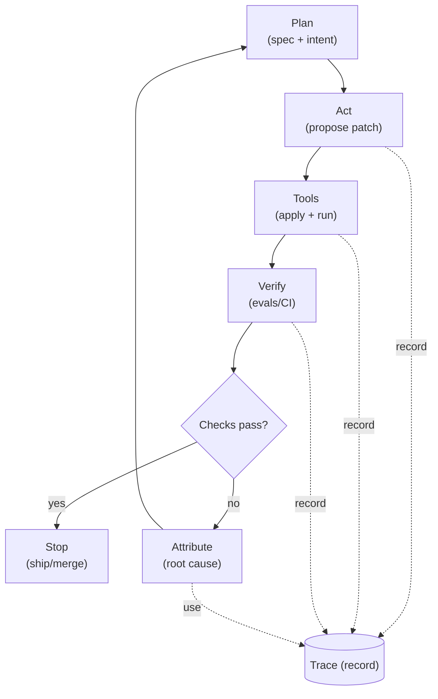

# Chapter 01 — Paradigm Shift

## Thesis

AI-first software engineering is an architectural inversion. Machine reasoning becomes a primary execution substrate. The harness—tools, constraints, evaluation, and traceability—becomes the primary design surface.

This inversion is practical: reliability comes from constraints, evaluations, and traces that turn generated changes into a repeatable loop.

A concrete, testable implication (holding the model constant):

1. A stronger harness should reduce *iterations-to-pass*.
2. A stronger harness should reduce *time-to-green*.
3. A stronger harness should increase *attribution rate* (more failures have a primary cause you can act on).

Operational definition:

- **Model capability** changes when you swap models while holding tools, constraints, and evaluation constant.
- **Harness capability** changes when you keep the model constant but alter tools, policies, evaluation gates, or trace capture.

In this framing, *attribution rate* is a harness outcome. It depends on what evidence you capture and which evaluation gates you run. It is not just a function of model fluency.

This chapter’s claim is a hypothesis: some observed “capability” gains in practice are attributable to harness engineering rather than model changes.

## Why This Matters

- Without a clear boundary between model capability and harness capability, teams misattribute failures and waste effort.
- Reliability depends on reproducible loops (plan → act → verify) rather than isolated prompts.
- Production constraints (auditability, security, cost, regression control) require system design, not “prompting.”

## System Breakdown

- **Actors**: human governor, agent loop, tools/runtime, evaluation/CI.
- **Artifacts**: specs, plans, diffs, traces, eval results, decision records.
- **Invariants** (hypotheses to test):
  - Every non-trivial change is traceable to a plan and verified by checks.
  - The system can attribute regressions to a layer (prompt, tool, code, eval).
  - Autonomy is gated by evaluations and budgets.

A diagram helps here because the model vs harness distinction changes how evidence moves through the loop. Focus on two points: where the trace is recorded, and where it is used to decide the next plan.

Legend:

- **Solid arrows** are the operational loop (plan → act → verify).
- **Dashed arrows** are trace capture and trace usage.

Takeaway: without a trace, attribution is guesswork. You will not know whether the next action is to clarify the spec, fix a tool issue, change product code, or correct an evaluation.

- **Measurable signals** (to separate model vs harness effects):
  - *Iterations-to-pass*: number of propose→verify cycles until all required checks pass.
  - *Time-to-green*: wall-clock time from first attempt to passing evaluation gates.
  - *Attribution rate*: fraction of failures with a clear primary cause.
    - Bucket: prompt/spec vs tool/runtime vs code vs eval.
- **Attribution checklist** (what evidence makes a failure “belong” to a layer):
  - **Spec/prompt**:
    - The requirement is ambiguous, contradictory, or incomplete.
    - Two reasonable interpretations produce different expected outputs.
    - Clarifying text changes the expected outcome without any code changes.
  - **Tool/runtime**:
    - Tool errors, timeouts, missing permissions, or a flaky environment.
    - Reruns on the same commit produce different outcomes.
    - The failure depends on machine state (filesystem, network, credentials, resources).
  - **Code**:
    - Deterministic failing tests or typechecks tied to a specific diff.
    - Reverting the diff restores the previous behavior.
    - The failure reproduces across environments given the same inputs.
  - **Eval/CI**:
    - The asserted behavior does not match the intended behavior.
    - The check is incorrect, overly strict, or missing a required case.
    - Fixing the test changes outcomes without changing product behavior.

## Concrete Example 1

Refactor a small library function using an agent loop.

- Inputs: failing unit test + desired behavior specification (e.g., a short “Given/When/Then” note checked into the repo).
- Loop: propose patch → run tests → inspect diff → record trace (commands + outputs) → stop on pass.

- Minimal trace record (copyable):

  Inputs:

  | Field | Value |
  | --- | --- |
  | Spec note path | `docs/specs/parse-date.md` (example) |
  | Failing test | `tests/test_parse_date.py::test_rejects_empty` |

  Run evidence:

  | Field | Value |
  | --- | --- |
  | Commands (in order) | `pytest -q` `ruff check .` (example) |
  | Diff identifier | commit SHA or patch ID (e.g., `abc1234`) |
  | Evaluation outputs | failing test names exit codes first failing assertion (or minimal log excerpt) |

  Attribution:

  | Field | Value |
  | --- | --- |
  | Attribution decision | one of `{spec/prompt, tool/runtime, code, eval/CI}` |
  | Evidence | 1–2 sentences tied to the outputs above |

  Example attribution:
  - **code** — the same test fails deterministically after the diff; reverting the diff restores pass.

- Measured outputs:
  - Iterations-to-pass.
  - Time-to-green.
  - Diff size (files touched, lines changed).
  - Locality: changes stay within the intended function/surface area.
  - Attribution per iteration using the checklist above (recorded in the trace).

- Stop rule:
  - Stop when the original failing test passes and the full unit test suite passes.
  - Also require the diff to stay constrained to the intended surface area.
  - If you hit a fixed budget (N iterations or T minutes), stop and hand off:
    - the trace record
    - the smallest reproducible failing case

## Concrete Example 2

Ship a minor API change in a production service.

- Inputs: API contract + backward-compat constraints + staging environment + a defined rollout/rollback policy.
- Loop: generate migration plan → implement → run contract tests → produce trace report (diff + commands + results) → human approve.

- Minimal trace report (copyable):

  Contract + constraints:

  | Field | Value |
  | --- | --- |
  | Contract/version | `openapi.yaml` (example) |
  | Compatibility window | “compatible within v1.x” |
  | Backward-compat constraints | “no required fields added” “no behavior change on existing endpoints” |
  | Staging target | `staging-us-east-1` (example) |

  Evidence + outputs:

  | Field | Value |
  | --- | --- |
  | Commands (in order) | `make contract-test` `npm run lint` `npm run typecheck` `./scripts/staging-smoke.sh` |
  | Diff identifier | PR number + commit SHA (e.g., `PR #482`, `def5678`) |
  | Evaluation outputs | failing checks log paths/links timestamps (supports time-to-green) |
  | Attribution decisions | per failure: `{spec/prompt, tool/runtime, code, eval/CI}` + evidence |

  Example attribution:
  - **eval/CI** — contract test rejects an allowed optional field; fixing the assertion changes outcomes without changing API behavior.

- Measured outputs:
  - Iterations-to-pass and time-to-green (from first migration-plan draft to all required checks passing in staging).
  - Attribution rate per iteration using the checklist above (spec/prompt vs tool/runtime vs code vs eval).
  - Backward-compat outcomes:
    - contract-test failures introduced (required gate: 0 new failures in required checks)
    - rollback verification in staging (required gate: exercise rollback successfully at least once)
    - time-to-green (default target: ≤ 30 minutes from first implementation attempt to all required checks passing in staging; set per service)

- Guardrails:
  - Protected paths or modules that require explicit human review before edits (e.g., auth, billing, infra).
  - Required checks (contract tests, integration tests, lint/typecheck, and a staging smoke test).
  - Rollback plan defined up front (feature flag, config switch, or revert procedure) and verified in staging.
  - Approval gate: no deploy until a human reviews the migration plan, the diff, and the evaluation results.
  - Mapping: Guardrails define *what must be protected*, required checks define *what must be proven*, and the approval gate defines *who must accept the evidence* before deploy.

- Stop rule:
  - Stop when all required checks pass in staging and the migration plan matches backward-compat constraints.
  - Require that the trace report can explain every material change.
  - If you hit a fixed budget (N iterations or T minutes), pause the rollout and escalate with:
    - the trace report
    - the smallest reproducible failing case
  - If any guardrail is violated (protected file touched, required test skipped, rollback unclear), stop immediately and require human intervention.

## Trade-offs

- Strong harness constraints reduce freedom (and sometimes speed) but increase reproducibility.
- More evaluation gates reduce regressions but add compute and latency.
- Trace-heavy workflows improve debugging but increase storage and privacy considerations.

## Failure Modes

- **Illusion of capability**: improvements credited to the model when they come from better tooling/evals.
- **Unbounded autonomy**: loops run without budgets, causing tool thrash and unclear outcomes.
- **Non-attributable failures**: missing traces make regressions un-debuggable.

Use the attribution checklist above to bucket each failure (spec/prompt vs tool/runtime vs code vs eval/CI) before you change the system. Otherwise the “fix” is likely to target the wrong layer.

Synthesis: treat machine reasoning as an execution substrate, and treat the harness as the primary lever for reliability. Track the loop metrics above to separate harness effects from model effects and to make failures actionable.

## Research Directions

- Metrics that separate model improvements from harness improvements.
- Minimal trace schema that supports attribution and replay.
- Formal definitions of autonomy envelopes and stop conditions.
