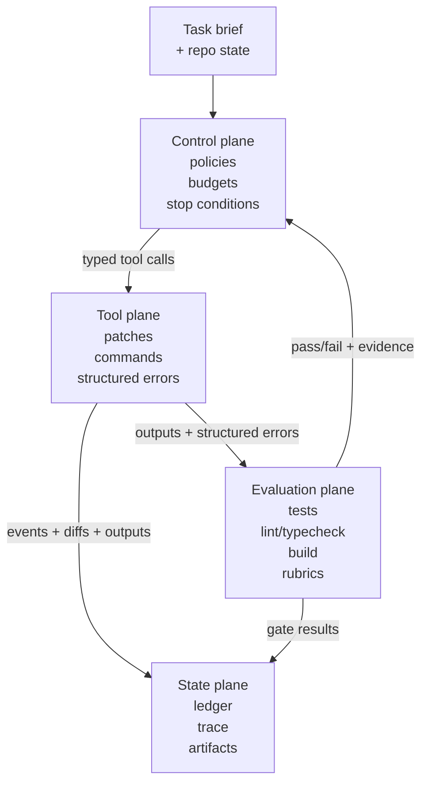
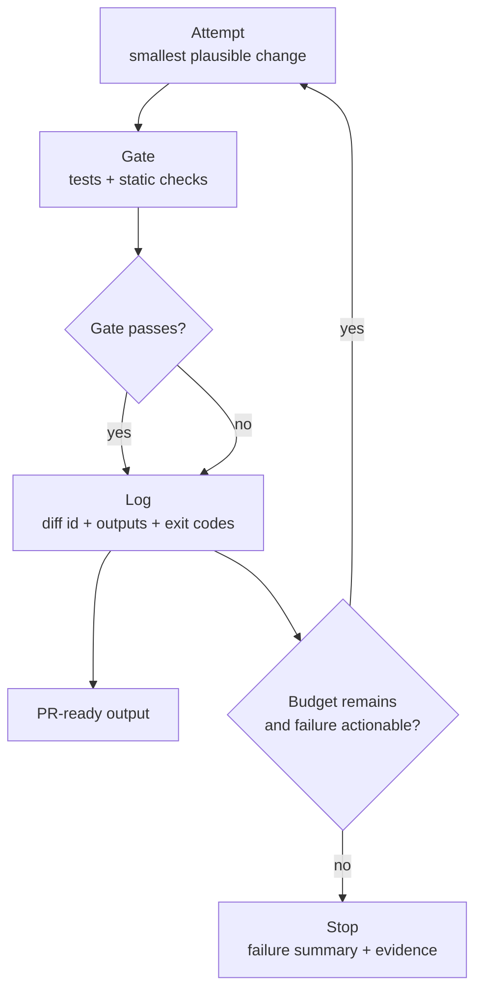

# Chapter 02 — Harness Engineering

## Thesis

Harness engineering is the discipline of turning a general-purpose model into a predictable system. It does that by defining tool contracts, constraints, loop control, and evaluation gates.

In this chapter, “predictable” means three things:

1. **Repeatability**: the same input context tends to produce the same classes of actions.
2. **Boundedness**: the system’s allowed changes are limited by explicit constraints.
3. **Verifiability**: outputs can be accepted or rejected by checks, not judgment calls.

When this chapter says “agent,” it means a model operating inside a harnessed loop: tool calls + budgets + gates + logging. The hypothesis is about that loop. The model is treated as an input you hold constant while you change harness strictness.

Hypothesis (falsifiable): tightening the harness reduces regression rate and rework. This effect is larger than swapping between models of similar capability, when tasks and repos are held constant.

For this chapter, define those outcomes in a way that can be measured across repos:

- **Regression rate**: fraction of tasks that pass the configured gate and later fail, or are reverted.
  - Measure in a fixed window. Example windows: next N commits; next full CI run.
- **Rework**: extra attempts needed to reach a passing gate.
  - Count attempts beyond the first, under a fixed time and iteration budget.

This is not a model-selection argument. The claim is that, when you hold the model and task conditions constant, harness design is the primary lever that changes reliability outcomes.

To test that hypothesis, hold these constant:

- The task set (same prompts and acceptance criteria).
- The repositories and their starting commits.
- The agent instructions and tool availability (only harness strictness changes).

## Why This Matters

- The same model can behave reliably or unreliably depending on tool schemas, budgets, and verification.
- Teams can standardize harness practices even when models change.
- Production safety and auditability primarily live in the harness layer.
- If you change the model while changing the harness, you lose the ability to attribute improvements to harness design.

If you want evidence for the hypothesis, keep the model constant (or compare models in the same capability band) and vary only harness strictness. Otherwise, changes in regression rate and rework can be explained by model behavior instead of harness design, and the experiment stops being diagnostic.

## System Breakdown

- **Control plane**: prompts, policies, budgets, stop conditions.
- **Tool plane**: filesystem edits, build/test runners, linters, browsers, APIs.
- **Evaluation plane**: checks as gates; regression suites; quality rubrics.
- **State plane**: task ledger, traces, decisions, artifacts.
- **Interfaces**:
  - Tool schemas and error contracts.
  - Patch discipline (diff-only, small changes).
  - Evaluation API (what constitutes pass/fail).

A diagram helps here because the planes are easy to list, but harder to reason about as a system.
Focus first on where constraints enter (control plane).
Then track where evidence is produced (tool and evaluation planes).
Finally, track what gets recorded for replay (state plane).



Legend (how to read arrow labels):

- “typed tool calls” are constrained requests. They are validated before execution.
- “outputs + structured errors” are raw evidence. They explain what happened and why.
- “events + diffs + outputs” are replay inputs. They let you reproduce decisions.

Read the diagram as a loop with three distinct roles:

- **Constraints** enter in the control plane (policies, budgets, stop conditions).
- **Evidence** is produced by the tool and evaluation planes (outputs + pass/fail).
- **Replay** depends on the state plane capturing enough artifacts to reproduce decisions.

A practical mapping is simple.
The control plane defines constraints.
The tool and evaluation planes produce evidence.
The state plane records enough detail for replay.
If you cannot point to those responsibilities in your implementation, the harness will drift toward “best effort.”

A useful way to operationalize the planes is to name what each plane consumes, what it produces, and one metric you can track:

| Plane | Responsibilities | Key artifacts (inputs/outputs) | One measurable metric |
| --- | --- | --- | --- |
| Control plane | Decide what the agent is allowed to do and when to stop | **Inputs**: task brief; policy; time/iteration budget<br/>**Outputs**: chosen strategy; stop reason | Iterations to first passing gate |
| Tool plane | Perform actions with bounded, typed interfaces | **Inputs**: validated tool calls<br/>**Outputs**: patches; command outputs; structured errors | Patch locality (files/lines per task) |
| Evaluation plane | Decide if work is acceptable based on checks | **Inputs**: test/lint/typecheck/build results; rubrics<br/>**Outputs**: pass/fail + evidence | Gate pass rate (per iteration) |
| State plane | Record what happened and enable recovery | **Inputs**: events; diffs; tool outputs<br/>**Outputs**: trace; ledger; artifacts for replay | Reproducibility rate (same pass/fail on rerun) |

The “minimal contract surface” is the smallest set of stable interfaces required for repeatability, boundedness, and verifiability. In practice, it is a checklist:

- A tool schema with stable arguments and stable error codes.
- Patch discipline that keeps changes local (diff-only, bounded by budgets).
- Gate semantics that define pass/fail and required evidence (what is stored, and where).

Boundary:

- In scope: tool schemas, patch discipline, and gate semantics, including what evidence is recorded.
- Out of scope: runtime infrastructure details. Those can vary, as long as gate semantics and recorded artifacts stay consistent.

## Concrete Example 1

Design a tool contract for “apply patch” operations.

A minimal schema sketch can be made scannable by treating it like an interface spec.

**Schema (what to enforce, not just what to accept):**

- Identify exactly one target file (`path`).
- Anchor the edit with an exact, unique match (`old_str`).
- Bound the change with explicit budgets (files/lines/time).

**Fields + constraints (to keep edits local and reviewable):**

- Required fields: `path`, `old_str`, `new_str`.
- Optional field: `context` (only for disambiguation).
- Constraints:
  - No unrelated whitespace changes outside `old_str`.
  - No implicit multi-file edits per call.
  - Size budget (for example: max files changed; max lines changed).

| Category | Field / rule | Purpose | Example failure mode |
| --- | --- | --- | --- |
| Required fields | `path` | Identify the target file | Wrong path → cannot apply patch |
| Required fields | `old_str` | Provide an exact, unique match anchor | Stale context → no match |
| Required fields | `new_str` | Provide the replacement text | N/A (validated as string) |
| Optional fields | `context` | Disambiguate or narrow a match | Without it, match may be non-unique |
| Constraints | No unrelated whitespace changes outside `old_str` | Preserve locality and reviewability | “Formatting spill” across file |
| Constraints | No implicit multi-file edits | Bound scope per call | Patch tool touches multiple files |
| Constraints | Size budget (e.g., max changed lines per call) | Prevent runaway diffs | Large diff for small task |

**Error contract (how the harness makes failures recoverable):**

- Return a stable error code.
- Return the minimum context needed to retry safely (snippets/ranges/limits).
- Do not “auto-expand” scope to make the error go away.

| Error code | Meaning | What the harness should return |
| --- | --- | --- |
| `NOT_FOUND` | `path` does not exist and `create` is false | A clear message plus allowed path roots (if any) |
| `NON_UNIQUE_MATCH` | `old_str` matches multiple locations | Candidate ranges or small snippets for each match |
| `NO_MATCH` | `old_str` matches zero locations | A “fresh context” snippet around the closest match |
| `BUDGET_EXCEEDED` | Change size violates configured limits | The computed line/file counts and configured limits |
| `POLICY_VIOLATION` | Edit touches forbidden paths or patterns | The specific policy rule that triggered |

**Happy path flow:**

1. Agent proposes a patch using a unique `old_str` block with minimal scope.
2. Harness validates: file exists, match is unique, diff stays within budgets.
3. Tool applies the patch and returns a structured result: changed line counts, a before/after snippet, and a stable identifier for the diff.

**Conflict recovery (when the patch fails with `NO_MATCH` or `NON_UNIQUE_MATCH`):**

1. The harness returns the error code plus a short “fresh context” snippet around the closest match (or a list of candidate match ranges).
2. The agent re-reads the relevant portion of the file and regenerates a smaller, more specific `old_str` (or narrows by adding `context`).
3. If the second attempt fails, the harness forces a stop condition (“needs human review”) rather than allowing a whole-file overwrite.

**Mini-example (connecting the contract to measurable outcomes):**

- Task: “Update `timeout_ms` default from 5000 to 8000.”
- Without a strict contract:
  - The agent runs a broad search/replace.
  - It touches 6 files, including docs and unrelated constants.
- With the contract and budgets:
  - Constraint: max 1 file changed per call.
  - Constraint: max 20 changed lines per call.
  - Result: the edit is limited to one file, anchored by a small `old_str` block.
- Metrics you should see move:
  - **Diff locality**: stays low (1 file, a few lines).
  - **Revert rate**: drops, because incidental edits are less likely.

**Evaluation (task-level metrics to track):**

- **Revert rate**: fraction of tasks where the patch is reverted in the next N commits/PR updates.
- **Diff locality**: median number of files touched and lines changed per task, with an alert threshold for outliers.

## Concrete Example 2

Add an evaluation gate to an agent loop.

A diagram helps here because “attempt → gate → log → decide” is simple to say, but easy to implement incorrectly.
Focus on two decision points: whether the gate passed, and whether another iteration is allowed under budgets.



Pseudo-code makes the loop control explicit. It is useful when you want the order of operations, evidence capture, and stop conditions to be unambiguous.

```text
// One harness iteration
Attempt("smallest plausible change")
GateResult -> RunGate("tests + static checks")
Log("diff id", GateResult, "stdout/stderr", "exit codes")

If GateResult == "pass" Then Emit("PR-ready output") Else If BudgetRemains() Then Retry("next attempt") Else Stop("failure summary + evidence")
```

Decision checklist (minimal, explicit):

1. **Pass/fail semantics**
   - Pass = all configured checks return success (exit code 0).
   - Pass also requires: no policy violations were triggered.
   - Fail = any check fails.
   - Fail also includes: any policy violation or budget exceed.
2. **Retry eligibility**
   - Retry only when budgets remain.
   - Retry only when the failure is actionable.
   - Otherwise, stop and return a failure summary plus evidence.
3. **Gate configuration (minimal defaults)**
   1. Define the full gate as a fixed set of commands, in order.
   2. Define time and iteration budgets per task.
   3. Define evidence requirements.
      - Store exit codes.
      - Store stdout/stderr (or paths to logs).
      - Store the diff identifier.
4. **Fallback gate policy when tests are missing**
   1. Can the repo’s documented test command run successfully in this environment?
      - If yes: use `full_gate`.
   2. If not, can you make tests runnable within the configured budget?
      - If yes: fix within budget, then use `full_gate`.
   3. If you cannot make tests runnable within budget:
      - Use `fallback_gate`.
      - Tighten patch budgets.
      - Record which gate was used (`full_gate` vs `fallback_gate`) and why.

A minimal `fallback_gate` is narrower and stricter:

- typecheck/lint/build must pass (whatever subset is available), and
- a targeted command or script (documented in the repo) must run successfully, and
- the change must be limited by stricter patch budgets (smaller allowed diffs).

Mini-example (gate policy with metrics):

- Task: “Rename `UserID` to `user_id` in a Python module.”
- Budgets: max 2 iterations; max 10 changed lines per iteration.
- Repo state: a documented test command exists, but it fails immediately due to a missing system dependency.
- Gate choice: use `fallback_gate` plus stricter patch budgets.
- Iteration 1:
  - Attempt: change one file and update one reference.
  - Gate: lint/typecheck passes; targeted script fails with an import error.
- Iteration 2:
  - Attempt: add the missing import in the same file.
  - Gate: lint/typecheck passes; targeted script passes.
- Recorded metric: iterations to first passing gate = 2.

## Trade-offs

- Richer tool schemas reduce ambiguity but raise integration cost.
- Strict budgets prevent runaway loops but can truncate legitimate work.
- Strong gates improve safety but may block progress on tasks lacking tests.

Decision checklist (recommended defaults and when to relax):

- **Tool schemas**:
  - Default: prefer typed, validated arguments plus explicit error codes for recovery.
  - Relax when: prototyping a new tool where integration speed matters more than repeatability, but only in non-production contexts.
- **Patch budgets**:
  - Default: small, diff-only edits with per-call and per-task size limits.
  - Relax when: performing mechanical, reviewable migrations (e.g., dependency rename) where change breadth is intentional and measurable.
- **Evaluation gates**:
  - Default: require passing tests and static checks (a minimal green CI run) before any final output.
  - Relax when: the repo cannot run tests in the current environment; use an explicit fallback gate and tighten patch budgets rather than skipping evaluation.
- **Stop conditions**:
  - Default: stop on repeated failure modes (same check failing twice) with a structured report.
  - Relax when: failures are due to flaky infrastructure and you can rerun deterministically (record rerun count as part of the trace).

## Failure Modes

- **Schema underspecification**: tools accept ambiguous inputs, producing inconsistent outcomes.
  - Symptoms:
    - Frequent `NO_MATCH` and `NON_UNIQUE_MATCH` failures.
    - Large diffs for small tasks.
    - High variance across reruns with the same inputs.
  - Harness response:
    - Tighten required fields.
    - Add validation (uniqueness checks and size budgets).
    - Return structured error codes plus fresh context to guide recovery.
- **Over-permissive harness**: agents change broad parts of the repo with weak verification.
  - Symptoms:
    - Many files touched per task.
    - Drift into unrelated directories.
    - Regressions discovered after “completion.”
  - Harness response:
    - Enforce patch locality budgets.
    - Add path allowlists and denylists.
    - Require passing gates before accepting final output.
- **Gate bypass**: humans accept outputs without running checks, breaking the feedback loop.
  - Symptoms:
    - “Merged without green checks.”
    - Missing logs or evidence in the ledger.
    - Recurring regressions that gates would have caught.
  - Harness response:
    - Make gates non-optional for PR-ready output (policy).
    - Require artifacts (logs, diff id, check results) attached to the task.
    - Surface a stop reason when required evidence is missing.

## Research Directions

- Harness quality metrics (iteration efficiency, regression rate, reproducibility).
  - Open question: which small set of metrics best predicts long-term reliability across repos?
  - Evaluation approach: track iterations to first passing gate, revert rate, and reproducibility rate using the plane metrics table, then compare distributions before/after harness changes.
  - Hypothesis link: if harness tightening drives reliability more than model swaps, these distributions should improve (fewer iterations, fewer reverts, higher reproducibility) even when the model is held constant.
- Tool error taxonomies that guide automated recovery.
  - Open question: what error codes enable the highest “self-repair” rate without encouraging risky retries?
  - Evaluation approach: measure recovery success rate per error code (e.g., `% resolved within 2 retries`) and the resulting diff locality, using structured tool returns.
  - Hypothesis link: a tighter harness should shift failures from “silent bad edits” toward typed, recoverable errors, increasing recovery success without increasing diff locality.
- Portable harness templates across languages and repo types.
  - Open question: what parts of the contract surface are truly portable (schemas, budgets, gates) versus language-specific?
  - Evaluation approach: apply a template to multiple repos, then compare reproducibility rate and gate pass rate changes while holding model choice constant.
  - Hypothesis link: if harness design is the primary lever, a portable template should produce consistent improvements across repos without requiring a different model.
