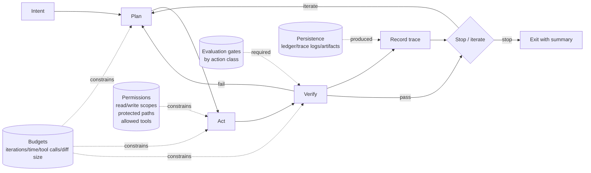

# Chapter 03 — Autonomous Kernels

## Thesis
An autonomous kernel is a minimal, well-specified control loop for bounded work: plan, apply tool actions, verify, and stop. It is designed for short-horizon execution with explicit budgets and explicit exit criteria, so its behavior is inspectable and repeatable. It is not a substitute for long-horizon project management or open-ended exploration.

What this is (and is not):

- A kernel **executes one bounded objective** and stops; it does not “keep going” to find adjacent work.
- A kernel **operates inside a declared safety envelope** (budgets + permissions + evaluation gates); it does not expand scope implicitly. Here, “safety envelope” means the explicit combination of budgets, permissions, and evaluation gates. It bounds what actions are allowed and what evidence is required to declare success.
- A kernel **treats verification as mandatory** (or explicitly waived with recorded justification); it does not declare success from intent or plausibility.

Definitions:

- **Autonomous kernel**: a control loop with explicit limits and explicit exit criteria; it is not “general autonomy,” long-horizon project management, or open-ended exploration.
- **Budget**: a hard cap on resources (iterations, elapsed time, tool calls, diff size) that prevents runaway behavior and forces escalation when progress stalls.
- **Evaluation gate**: a required check whose result must be recorded and must be satisfied (or explicitly waived with justification) before the kernel can declare success.

Hypothesis: small, well-governed autonomous kernels (tight loops with explicit budgets and evaluation gates) outperform broad autonomy in stability and debuggability.

## Why This Matters
- Most failures in agentic work are operational: runaway loops, untraceable edits, and unverifiable outcomes.
- Kernels enable composability: multiple kernels can run with different permissions and evaluation profiles.
- “Kernel-first” design makes autonomy a system property, not a prompt trick.

## System Breakdown
- **Kernel loop**: intent → plan → act → verify → record trace → stop/iterate.
- **Budgets**: max iterations, time, tool calls, diff size.
- **Permissions**: read/write scopes, protected paths, allowed tools.
- **Verification**: mandatory checks per action class (e.g., tests for code changes).
- **Persistence**: ledger entries, trace logs, artifacts.

Treat each loop step as a checkpoint with two requirements: (1) what must be recorded, and (2) what stop condition must be evaluated.

1. **Intent**: state the task class and the success condition.
   - Must record: intent string + success criteria (e.g., “repro no longer fails”).
   - Stop condition: if success criteria are ambiguous, stop and request clarification.

2. **Plan**: enumerate the next 1–3 actions only, each tied to a gate and a budget slice.
   - Must record: planned steps + named gates + allocated budget slice.
   - Stop condition: if the plan requires tools/paths outside permissions, stop and request escalation.

3. **Act**: perform the minimal change that tests the current hypothesis.
   - Must record: files touched + diff stats (and any migration steps taken).
   - Stop condition: if diff budget or file-touch budget is exceeded, stop and escalate.

4. **Verify**: run the smallest evaluation that is credible for the task class.
   - Must record: exact command(s) + exit codes + summary lines (or pointers/hashes to full logs).
   - Stop condition: if a gate fails, iterate; if no credible gate exists, stop and escalate.
   - Gate waivers: acceptable only when the trace records (a) why the gate is not runnable, (b) what alternative check was run, and (c) what risk remains. A waiver is not a “pass”; it is a recorded exception.

5. **Record trace**: persist replayable evidence for what happened and why.
   - Must record: commands executed, outputs (or pointers), budgets consumed, permissions exercised.
   - Stop condition: if persistence fails (cannot write trace), stop; do not continue “blind.”

6. **Stop/iterate**: decide based on evidence and remaining budget.
   - Must record: decision + rationale + the next action (either “done” or “what to try next”).
   - Stop condition: stop on success, or when a budget is exhausted, or when permissions/scope are insufficient.

Mermaid mapping of stages to controls and outputs:

How to read this diagram:

- Solid arrows show the execution order; dotted arrows show constraints that shape what actions are allowed.
- Gates flow into **Verify** because “done” is a verification outcome, not an intent.
- Persistence flows out of **Record trace** because the trace is an output, not a side effect.

A compact “must capture” checklist (minimum viable trace).

This is the smallest set of fields that enables replay, audit, and debugging without relying on memory or “it seemed fine.”

| Loop stage | Budget signal | Permission signal | Verification signal | Persistence artifact |
|---|---|---|---|---|
| intent | remaining iterations/time | required read scope | success criteria defined | intent string + criteria |
| plan | tool-call budget allocation | allowed tools list | planned gates named | plan steps + gate mapping |
| act | diff size consumed | write scope used | N/A | patch/diff stats |
| verify | time/tool calls consumed | execution permissions | gate results (pass/fail) | command + exit code + excerpt |
| record trace | N/A | N/A | N/A | ledger entry + trace pointer |
| stop/iterate | budget exhausted? | permission insufficient? | gates satisfied? | final summary + next action |

## Concrete Example 1
Bug-fix kernel for a CLI tool.

- Input:

  - failing test case: `tests/test_parse.py::test_rejects_empty_input`
  - reproduction step: `python -m mycli parse ""` returns exit code `0` but should return non-zero
  - budgets: max 3 iterations, max 10 tool calls, max 40 lines changed
  - permissions: read `src/`, write `src/parser.py`, run `pytest -k parse`

Mini-runbook (a single bounded kernel run):

1. Localize failure (evidence-first)
   - Action: reproduce with the smallest credible check.
     - Command: `pytest -k rejects_empty_input`
   - Gate: the reproduction must fail in a controlled way (same assertion, same path).
   - Record:
     - command + exit code: `pytest -k rejects_empty_input` (exit code `1`)
     - failing excerpt (example):
       - `>       assert parse("") != 0`
       - `E       AssertionError: assert 0 != 0`
     - test summary line (example): `1 failed, 42 deselected in 0.31s`
   - Stop rule: if the failure does not reproduce, stop and return a “cannot reproduce” trace (no edits).

2. Patch minimal surface (hypothesis-driven)
   - Action: implement the smallest boundary check consistent with the hypothesis.
     - Hypothesis: empty string is being treated as a valid token stream in `src/parser.py`.
     - Change: reject empty input at the parse entrypoint (avoid touching downstream call sites).
   - Gate: diff must remain within 40 lines and touch only `src/parser.py` (unless escalation is explicitly allowed).
   - Record:
     - files touched: `src/parser.py`
     - diff stats (example): `src/parser.py | 7 ++++++-`
   - Stop rule: if a second file is required, stop and escalate (“write scope too narrow”).

3. Run verification gate (tight but credible)
   - Action: rerun the failing test, then a small related slice.
   - Gate 1 (target): `pytest -k rejects_empty_input`
     - Expected summary (example): `1 passed, 42 deselected in 0.28s`
   - Gate 2 (related): `pytest -k parse`
     - Expected summary (example): `12 passed, 0 failed, 31 deselected in 1.07s`
   - Record: both commands, exit codes (`0`), and the summary lines.
   - Stop rule: if Gate 1 passes but Gate 2 fails, treat as “not fixed” and iterate (the patch likely broke a nearby invariant).

4. Record trace (auditable, replayable)
   - Action: persist a kernel trace and a ledger entry.
   - Record (minimum):
     - budgets consumed: `iterations=1/3`, `tool_calls=3/10`, `diff_lines=7/40`
     - commands executed + exit codes
     - final test summary lines:
       - `12 passed, 0 failed, 31 deselected in 1.07s`
   - Stop rule: if trace persistence fails, stop; do not continue with further edits.

5. Stop criteria (explicit)
   - Stop success: Gate 1 and Gate 2 pass within budget.
   - Stop failure: tool-call budget exhausted, diff budget exceeded, or verification indicates a broader refactor is required.
   - Stop escalation output: include the next action for a human (e.g., “tokenization treats whitespace-only as empty; requires editing `src/lexer.py`, outside current write scope”).

## Concrete Example 2

Dependency upgrade kernel.

- Input:

  - target version: `libX 4.2.0 → 4.3.0`
  - constraints: Python `>=3.10`, cannot change public API, CI must stay green
  - upgrade guide: notes a breaking rename `OldClient` → `Client`
  - budgets: max 4 iterations, max 15 tool calls, max 120 lines changed
  - permissions: write `pyproject.toml` and `src/`, run `python -m compileall` and `pytest`

Kernel steps with an explicit remediation branch:

1. Update manifest (narrow scope)
   - Action: bump version constraint in `pyproject.toml`.
   - Record:
     - old/new constraint strings (example): `libX>=4.2,<4.3` → `libX>=4.3,<4.4`
     - diff stats for manifest only (example): `pyproject.toml | 1 +-`
   - Stop/iterate rule:
     - If the dependency resolver cannot produce a consistent lock, stop with resolver output (do not attempt ad-hoc pinning unless that is explicitly in scope).

2. Run a fast build/type gate before full tests
   - Gate A (fast): import/type/compile smoke check.
     - Command: `python -m compileall src`
   - Record:
     - exit code
     - compile summary lines (example):
       - `Listing 'src'...`
       - `Compiling 'src/app.py'...`
       - `compileall: success`
   - Interpretation:
     - If Gate A fails, it is often a missing symbol or incompatible API; remediate before running the full suite.

3. Remediation branch (compile errors vs failing tests)
   - If **compile/import fails**:
     - Localize: capture the first error site (file + symbol) from the compile output.
       - Example line: `***   File "src/integrations/libx.py", line 12`
       - Example line: `ImportError: cannot import name 'OldClient' from 'libx'`
     - Patch: apply the minimal mechanical fix (e.g., rename `OldClient` to `Client`) in the smallest set of files.
     - Verify: rerun Gate A only; proceed only when it returns exit code `0`.
     - Budget guard:
       - If more than 5 files are touched, stop and escalate (“requires broader refactor”).
       - If cumulative diff exceeds 120 lines, stop and escalate (“exceeds change budget for this kernel”).

   - If **compile passes but tests fail**:
     - Localize: run the smallest failing unit (single file or single test) based on the first failure.
       - Example: `pytest tests/test_libx_integration.py -q`
       - Example summary: `1 failed, 18 passed in 4.92s`
     - Patch: address the behavioral change with a targeted adjustment and record the reason (e.g., “libX now defaults timeout=None; set explicit timeout=5.0 in wrapper”).
     - Verify: rerun the failing tests, then proceed to the full suite gate.

4. Run full verification gate (credibility gate)
   - Gate B (full): run the test suite (or the project’s standard verification command).
     - Command: `pytest`
   - Record:
     - exit code
     - test summary line (example): `219 passed, 0 failed in 38.41s`
   - Verification risk handling:
     - A narrowed verification set is acceptable only as an explicit gate waiver: record why the full gate is unavailable, what alternative gate was run, and what risk remains. Do not label a waiver as “green”; label it as “waived.”

5. Stop criteria and outputs
   - Stop success: Gate A and Gate B pass within budget.
   - Stop failure: repeated failures indicate the upgrade exceeds current permission/scope (e.g., requires API redesign), or budgets are exhausted.
   - Required outputs on stop:
     - change summary: files touched + primary reason
     - verification summary: Gate A command + result and Gate B command + result, including summary lines
     - rollback plan: “revert manifest bump and lockfile” (or equivalent) with the exact files to revert

## Trade-offs

- Smaller kernels reduce risk but may require orchestration for multi-step projects.

  - Mitigation: use staged kernels (e.g., “diagnose-only” kernel → “patch” kernel → “refactor” kernel), each with separate budgets and permissions.

- Strict permissions reduce blast radius but can prevent necessary refactors.

  - Mitigation: use permission escalation as an explicit step with a justification and a widened verification gate (e.g., requiring a broader test suite when write scope expands).

- Heavier tracing improves auditability but adds operational overhead.

  - Mitigation: record a minimum viable trace by default (commands, diffs, gate results), and sample/expand traces only on failures or high-risk task classes.

## Failure Modes

- **Local minima**: kernel makes safe micro-edits without addressing root cause.
- **Tool thrash**: too many actions with low information gain.
- **False confidence**: passing a narrow eval set while violating higher-level requirements.

Detection signals (tie these to budgets and evaluation gates, not intuition):

- Local minima:
  - same verification failure across iterations with edits confined to the same small area
  - diff size steadily increases without any new localized evidence (no new failing test isolated, no tighter repro)
  - iteration budget is consumed with no change in the selected gate set or its outcome

- Tool thrash:
  - tool-call count rises while the plan and hypothesis remain unchanged
  - the same command is rerun without any intervening change that could affect its result
  - number of files touched increases despite a small, bounded intent

- False confidence:
  - gates become narrower over time without a recorded waiver justification and risk note
  - fast gates pass, but the credibility gate (broader suite) is repeatedly deferred without an explicit waiver record
  - success is declared without a trace artifact that includes exact gate commands, exit codes, and summary lines

## Research Directions

- Kernel composition patterns (delegation, staged permissions, multi-kernel workflows).
- Automatic stop-condition tuning based on task class.
- Replayable kernels for deterministic debugging of agent behavior.
