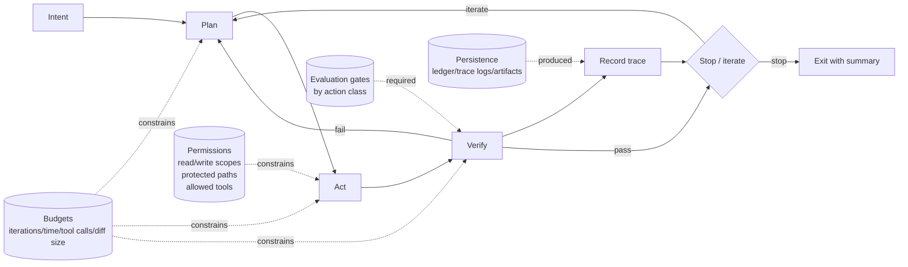

# Chapter 03 — Autonomous Kernels

## Thesis

An autonomous kernel is a minimal, well-specified control loop for bounded work: plan, apply tool actions, verify, and stop. It is designed for short-horizon execution with explicit budgets and explicit exit criteria, so its behavior is inspectable and repeatable. It is not a substitute for long-horizon project management or open-ended exploration.

What this is (and is not):

- A kernel **executes one bounded objective** and stops; it does not “keep going” to find adjacent work.
- A kernel **operates inside a declared safety envelope** (budgets + permissions + evaluation gates); it does not expand scope implicitly. Here, “safety envelope” means the explicit combination of budgets, permissions, and evaluation gates. It bounds what actions are allowed and what evidence is required to declare success.
- A kernel **treats verification as mandatory** (or explicitly waived with recorded justification); it does not declare success from intent or plausibility.

Definitions:

- **Autonomous kernel**: a control loop with explicit limits and explicit exit criteria; it is not “general autonomy,” long-horizon project management, or open-ended exploration.
- **Budget**: a hard cap on resources (iterations, elapsed time, tool calls, diff size) that prevents runaway behavior and forces escalation when progress stalls.
- **Evaluation gate**: a required check whose result must be recorded and must be satisfied (or explicitly waived with justification) before the kernel can declare success.

Hypothesis: small, well-governed autonomous kernels (tight loops with explicit budgets and evaluation gates) outperform broad autonomy in stability and debuggability.

## Why This Matters

- Most failures in agentic work are operational: runaway loops, untraceable edits, and unverifiable outcomes.
- Kernels enable composability: multiple kernels can run with different permissions and evaluation profiles.
- “Kernel-first” design makes autonomy a system property, not a prompt trick.

## System Breakdown

- **Kernel loop**: intent → plan → act → verify → record trace → stop/iterate.
- **Budgets**: max iterations, time, tool calls, diff size.
- **Permissions**: read/write scopes, protected paths, allowed tools.
- **Verification**: mandatory checks per action class (e.g., tests for code changes).
- **Persistence**: ledger entries, trace logs, artifacts.

The loop stages are the execution path. Budgets, permissions, and evaluation gates constrain each stage. They also define what evidence is required before stopping.

Treat each loop step as a checkpoint. Each checkpoint has three parts. Record requirements, stop conditions, and escalation or waiver rules.

1. **Intent**: state the task class and the success condition.
   - **Must record:**
     - intent string
     - success criteria (e.g., “repro no longer fails”)
   - **Stop condition:**
     - stop if success criteria are ambiguous
   - **Escalate / waive:**
     - request clarification; do not proceed with edits

2. **Plan**: enumerate the next 1–3 actions only, each tied to a gate and a budget slice.
   - **Must record:**
     - planned steps (1–3)
     - named gates for each step
     - budget slice per step
   - **Stop condition:**
     - stop if the plan requires out-of-scope tools or paths
   - **Escalate / waive:**
     - request permission escalation before acting

3. **Act**: perform the minimal change that tests the current hypothesis.
   - **Must record:**
     - files touched
     - diff stats (and any migration steps taken)
   - **Stop condition:**
     - stop if diff budget is exceeded
     - stop if file-touch budget is exceeded
   - **Escalate / waive:**
     - request wider write scope, or narrow the plan

4. **Verify**: run the smallest evaluation that is credible for the task class.
   - **Must record:**
     - exact command(s)
     - exit codes
     - summary lines (or pointers/hashes to full logs)
   - **Stop condition:**
     - if a gate fails, iterate
     - if no credible gate exists, stop
   - **Escalate / waive:**
     - **Waive only if explicitly recorded:**
       - why the gate is not runnable
       - what alternative check was run
       - what risk remains
       - the waiver decision and rationale
     - A waiver is not a “pass”; it is a recorded exception.

5. **Record trace**: persist replayable evidence for what happened and why.
   - **Must record:**
     - commands executed
     - outputs (or pointers)
     - budgets consumed
     - permissions exercised
   - **Stop condition:**
     - stop if persistence fails (cannot write trace)
   - **Escalate / waive:**
     - do not continue “blind”; fix persistence or stop

6. **Stop/iterate**: decide based on evidence and remaining budget.
   - **Must record:**
     - decision (stop vs iterate)
     - rationale tied to gate results and budgets
     - next action (“done” or the next bounded attempt)
   - **Stop condition:**
     - stop on success (named gates satisfied)
     - stop when a budget is exhausted
     - stop when permissions/scope are insufficient
   - **Escalate / waive:**
     - output a handoff note (what evidence exists, what to try next)

A diagram is useful here because the stage order is fixed. Focus on the linear flow. Also note the side-constraints required before “stop” is allowed.

```mermaid
flowchart LR
  I[Intent] --> P[Plan] --> A[Act] --> V[Verify] --> R[Record trace] --> S{Stop / iterate}

  B[(Budgets<br/>iterations/time/tool calls/diff size)] -. constrains .-> P
  B -. constrains .-> A
  B -. constrains .-> V
  Perm[(Permissions<br/>read/write scopes<br/>protected paths<br/>allowed tools)] -. constrains .-> A
  Gate[(Evaluation gates<br/>by action class)] -. required .-> V
  Persist[(Persistence<br/>ledger/trace logs/artifacts)] -. produced .-> R

  V -->|pass| S
  V -->|fail| P
  S -->|iterate| P
  S -->|stop| End[Exit with summary]
```

How to read this diagram:

- Solid arrows show stage order; dotted arrows show constraints and required checks.
- **Verify** produces pass/fail evidence that drives stop vs iterate.
- Takeaway: “done” is a verification outcome, and trace artifacts are explicit outputs.

A compact “must capture” checklist (minimum viable trace).

This checklist is the smallest set of fields that enables replay, audit, and debugging. It avoids relying on memory or “it seemed fine.”

| Loop stage | Budget signal | Permission signal | Verification signal | Persistence artifact |
| --- | --- | --- | --- | --- |
| intent | remaining iterations/time | required read scope | success criteria defined | intent string + criteria |
| plan | tool-call budget allocation | allowed tools list | planned gates named | plan steps + gate mapping |
| act | diff size consumed | write scope used | N/A | patch/diff stats |
| verify | time/tool calls consumed | execution permissions | gate results (pass/fail) | command + exit code + excerpt |
| record trace | N/A | N/A | N/A | ledger entry + trace pointer |
| stop/iterate | budget exhausted? | permission insufficient? | gates satisfied? | final summary + next action |

## Concrete Example 1

Bug-fix kernel for a CLI tool.

- Input:
  - failing test case: `tests/test_parse.py::test_rejects_empty_input`
  - repro command: `python -m mycli parse ""`
  - observed exit code: `0`
  - expected: non-zero exit code
  - budgets:
    - iterations: max `3`
    - tool calls: max `10`
    - lines changed: max `40`
  - permissions:
    - read: `src/`
    - write: `src/parser.py`
    - run: `pytest -k parse`

Mini-runbook (a single bounded kernel run):

1. Localize failure (evidence-first)
   - Action:
     - reproduce with the smallest credible check
     - command: `pytest -k rejects_empty_input`
   - Gate:
     - the reproduction must fail in a controlled way
     - the failure should hit the same assertion and code path
   - Record:
     - command: `pytest -k rejects_empty_input`
     - exit code: `1`
     - failing excerpt (example):
       - `>       assert parse("") != 0`
       - `E       AssertionError: assert 0 != 0`
     - summary line (example): `1 failed, 42 deselected in 0.31s`
   - Stop rule:
     - if the failure does not reproduce, stop and return a “cannot reproduce” trace (no edits)

2. Patch minimal surface (hypothesis-driven)
   - Hypothesis:
     - empty string is being treated as a valid token stream in `src/parser.py`
   - Action:
     - implement the smallest boundary check consistent with the hypothesis
   - Change:
     - reject empty input at the parse entrypoint
     - avoid touching downstream call sites
   - Gate:
     - stay within 40 changed lines
     - touch only `src/parser.py` (unless escalation is explicitly allowed)
   - Record:
     - files touched: `src/parser.py`
     - diff stats (example): `src/parser.py | 7 ++++++-`
   - Stop rule:
     - if a second file is required, stop and escalate (“write scope too narrow”)

3. Run verification gate (tight but credible)
   - Action:
     - rerun the failing test
     - command: `pytest -k rejects_empty_input`
     - expected summary (example): `1 passed, 42 deselected in 0.28s`
   - Action:
     - run a small related slice
     - command: `pytest -k parse`
     - expected summary (example): `12 passed, 0 failed, 31 deselected in 1.07s`
   - Record:
     - command 1: `pytest -k rejects_empty_input`
     - exit code 1: `0`
     - summary 1 (example): `1 passed, 42 deselected in 0.28s`
     - command 2: `pytest -k parse`
     - exit code 2: `0`
     - summary 2 (example): `12 passed, 0 failed, 31 deselected in 1.07s`
   - Stop rule:
     - if Gate 1 passes but Gate 2 fails, treat as “not fixed” and iterate
     - the likely cause is a nearby invariant break

4. Record trace (auditable, replayable)
   - Action:
     - persist a kernel trace and a ledger entry
   - Record (minimum):
     - budgets consumed: `iterations=1/3`
     - budgets consumed: `tool_calls=3/10`
     - budgets consumed: `diff_lines=7/40`
     - commands executed + exit codes
     - final test summary line:
       - `12 passed, 0 failed, 31 deselected in 1.07s`
   - Stop rule:
     - if trace persistence fails, stop; do not continue with further edits

5. Stop criteria (explicit)
   - Stop success:
     - Gate 1 and Gate 2 pass within budget
   - Stop failure:
     - tool-call budget exhausted
     - diff budget exceeded
     - verification indicates a broader refactor is required
   - Stop escalation output:
     - include the next action for a human
     - example: “tokenization treats whitespace-only as empty.”
     - example: “requires editing `src/lexer.py`, outside current write scope.”

This stays stable and debuggable because the kernel cannot declare success without passing named gates, and each iteration is bounded by explicit budgets.

## Concrete Example 2

Dependency upgrade kernel.

- Input:
  - target version: `libX 4.2.0 → 4.3.0`
  - constraints:
    - Python: `>=3.10`
    - public API: must not change
    - CI: must stay green
  - upgrade guide note:
    - rename: `OldClient` → `Client`
  - budgets:
    - iterations: max `4`
    - tool calls: max `15`
    - lines changed: max `120`
  - permissions:
    - write: `pyproject.toml`
    - write: `src/`
    - run: `python -m compileall`
    - run: `pytest`

Kernel steps with an explicit remediation branch:

1. Update manifest (narrow scope)
   - Action:
     - bump the version constraint in `pyproject.toml`
   - Record:
     - old constraint (example): `libX>=4.2,<4.3`
     - new constraint (example): `libX>=4.3,<4.4`
     - diff stats (example): `pyproject.toml | 1 +-`
   - Stop/iterate rule:
     - if the resolver cannot produce a consistent lock, stop with resolver output
     - do not attempt ad-hoc pinning unless it is explicitly in scope

2. Run a fast build/type gate before full tests
   - Gate A (fast):
     - import/type/compile smoke check
     - command: `python -m compileall src`
   - Record:
     - exit code
     - compile summary lines (example):
       - `Listing 'src'...`
       - `Compiling 'src/app.py'...`
       - `compileall: success`
   - Interpretation:
     - if Gate A fails, it is often a missing symbol or incompatible API
     - remediate before running the full suite

3. Remediation branch (compile errors vs failing tests)
   - If **compile/import fails**:
     - Localize:
       - capture the first error site (file + symbol)
       - example: `***   File "src/integrations/libx.py", line 12`
       - example: `ImportError: cannot import name 'OldClient' from 'libx'`
     - Patch:
       - apply the minimal mechanical fix in the smallest set of files
       - example: rename `OldClient` to `Client`
     - Verify:
       - rerun Gate A only
       - proceed only if it returns exit code `0`
     - Budget guard:
       - if more than 5 files are touched, stop and escalate (“requires broader refactor”)
       - if cumulative diff exceeds 120 lines, stop and escalate (“exceeds change budget for this kernel”)

   - If **compile passes but tests fail**:
     - Localize:
       - run the smallest failing unit based on the first failure
       - example command: `pytest tests/test_libx_integration.py -q`
       - example summary: `1 failed, 18 passed in 4.92s`
     - Patch:
       - address the behavioral change with a targeted adjustment
       - record the reason for the change
       - example: “libX now defaults timeout=None; set explicit timeout=5.0 in wrapper”
     - Verify:
       - rerun the failing tests
       - proceed only after the localized failure is cleared

4. Run full verification gate (credibility gate)
   - Gate B (full):
     - run the test suite (or the project’s standard verification command)
     - command: `pytest`
   - Record:
     - exit code
     - test summary line (example): `219 passed, 0 failed in 38.41s`
   - Verification risk handling:
     - a narrowed verification set is acceptable only as an explicit gate waiver
     - record why the full gate is unavailable
     - record what alternative gate was run
     - record what risk remains
     - do not label a waiver as “green”; label it as “waived”

5. Stop criteria and outputs
   - Stop success:
     - Gate A and Gate B pass within budget
   - Stop failure:
     - repeated failures indicate the upgrade exceeds current scope
     - budgets are exhausted before gates pass
   - Required outputs on stop:
     - change summary:
       - files touched
       - primary reason
     - verification summary:
       - Gate A command + result (include summary lines)
       - Gate B command + result (include summary lines)
     - rollback plan:
       - “revert manifest bump and lockfile” (or equivalent)
       - exact files to revert

This avoids “fix-forward” drift by forcing an early gate (compile) to localize breakage, and by stopping when remediation expands beyond the change budget.

## Trade-offs

- Smaller kernels reduce risk but may require orchestration for multi-step projects.

  - Mitigation: use staged kernels (e.g., “diagnose-only” kernel → “patch” kernel → “refactor” kernel), each with separate budgets and permissions.

- Strict permissions reduce blast radius but can prevent necessary refactors.

  - Mitigation: use permission escalation as an explicit step with a justification and a widened verification gate (e.g., requiring a broader test suite when write scope expands).

- Heavier tracing improves auditability but adds operational overhead.

  - Mitigation: record a minimum viable trace by default (commands, diffs, gate results), and sample/expand traces only on failures or high-risk task classes.

## Failure Modes

- **Local minima**: kernel makes safe micro-edits without addressing root cause.
- **Tool thrash**: too many actions with low information gain.
- **False confidence**: passing a narrow eval set while violating higher-level requirements.

Detection signals should be tied to budgets and evaluation gates, not intuition.

| Failure mode | Detection signals (operational) |
| --- | --- |
| Local minima | Same verification failure repeats across iterations. Edits stay confined to the same small area. Diff size increases without new localized evidence (no tighter repro, no new failing test isolated). Iteration budget is consumed with no change in selected gates or outcomes. |
| Tool thrash | Tool-call count rises while the plan and hypothesis remain unchanged. The same command is rerun without an intervening change that could affect its result. Files touched increases despite a small, bounded intent. |
| False confidence | Gates get narrower over time without a recorded waiver and risk note. Fast gates pass, but the credibility gate is repeatedly deferred without an explicit waiver record. Success is declared without a trace artifact that includes exact gate commands, exit codes, and summary lines. |

## Research Directions

- Kernel composition patterns (delegation, staged permissions, multi-kernel workflows).
- Automatic stop-condition tuning based on task class.
- Replayable kernels for deterministic debugging of agent behavior.
