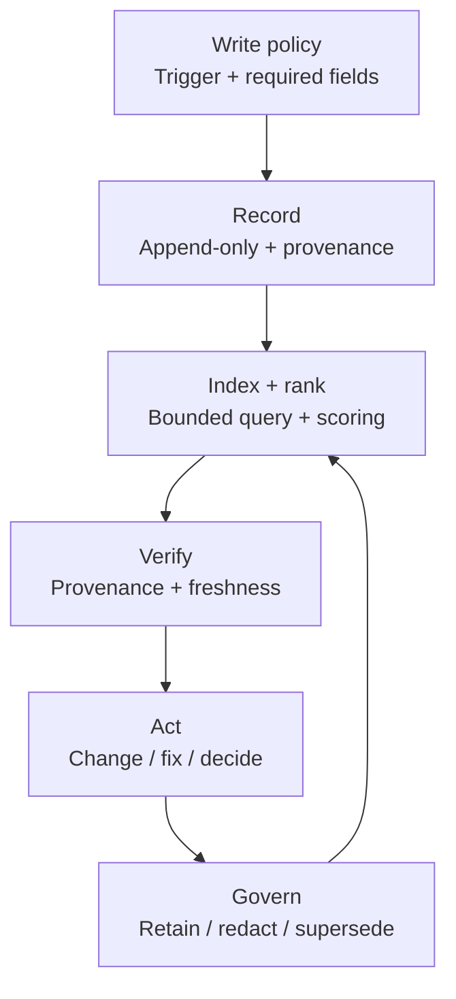

# Chapter 04 — Memory Systems

## Thesis

Memory is an engineered data store for work artifacts, not a raw log of prior messages.
It must be **structured**, **queryable**, and **governed** (with provenance) to improve long-horizon work.

- **Structured**: stored as records with explicit fields (not free-form chat logs), so constraints, sources, and updates are representable.
- **Queryable**: retrievable by filters (task, file, timeframe, decision id), with ranking that prefers fresh, high-provenance entries.
- **Governed**: subject to retention, redaction, and correction rules; these controls solve different problems and should not be conflated.
  - **Correction**: add a new record that `supersedes` a prior id (no silent edits).
  - **Redaction**: remove or mask sensitive content while preserving minimal provenance where policy allows.
  - **Retention**: apply expiry and access rules over time (e.g., via `valid_through` or class-specific TTLs).

Definition of done for “good memory”:

- **Structure**: every entry has `id`, `timestamp`, `type`, and `source`.
- **Query**: decisions and traces are retrievable with bounded filters.
- **Governance**: entries can be superseded, and can expire or be redacted under policy.

Hypothesis: uncurated memory increases confidence without increasing correctness, by amplifying earlier mistakes.

## Why This Matters

- Long projects exceed context windows; without memory, work becomes repetitive and inconsistent.
- Without provenance, persistent memory becomes a source of silent drift: older summaries can out-rank newer evidence.
- Production environments need data minimization and retention policies for stored traces and summaries.
- Those policies must connect to provenance (what the data came from) and correction (how wrong entries are handled).

## System Breakdown

Memory systems fail at the *interfaces* (write → retrieve → act).
Many failures show up *between* steps, not inside a single component.
A diagram makes those boundaries explicit.

As you read the diagram, focus on two gates:

- **Retrieval** is bounded and ranked.
- **Action** is gated by provenance and freshness checks.



End-to-end flow (top to bottom, then loop back through governance):

1. **Write policy**: decide *when* to store, and enforce required fields.
2. **Record**: create an append-only record with explicit provenance and (optional) expiry.
3. **Index + rank**: retrieve with bounded filters.
   Then rank by explicit rules.
   Hide expired entries by default.
4. **Verify**: check provenance and freshness, then re-check against current reality (often: rerun tests).
5. **Act**: only after verification passes (change, fix, decision).
6. **Govern**: apply retention/redaction, and correct via explicit superseding; governance feeds back into ranking.

Minimum schema fields (and exactly what they power):

These fields are a minimum viable baseline for this chapter (intentionally incomplete).
Implementations can add fields as needed without changing the Write/Read/Governance gates.

- `id`: stable reference used by later work and by corrections (`supersedes` targets this).
- `timestamp` / `valid_through`: freshness and expiry controls for ranking and default visibility.
  Expired `valid_through` entries should be hidden unless explicitly requested.
- `type`: bounded retrieval (e.g., only `decision` records when asking “what did we decide?”).
- `source` (pointer): provenance gate; “can I open the diff / log / doc this came from?”
- `confidence`: ranking signal tied to evidence quality (tests, review, reproducibility).
- `supersedes`: correction link; older records should be down-ranked/hidden by default when superseded.

Legend (one-line per gate):

- **Write**: decide *when* to store and enforce minimum fields (especially `source`, `confidence`, and optional `valid_through`).
- **Index + Rank**: retrieve with bounded filters, then sort with explicit rules (freshness, confidence, not-superseded).
  Hide expired `valid_through` by default.
- **Verify**: before acting, check provenance and freshness.
  If checks fail, refine the query or re-run tests.
- **Govern**: apply retention/redaction/correction.
  Corrections create new records that update ranking via `supersedes`.
- Schema extensions are fine, but they must not weaken provenance, freshness/expiry, or explicit superseding.
  Ranking and governance should still hinge on those fields.

Takeaway: the diagram makes the loop explicit.
Write policy populates fields with provenance.
Read policy uses those fields for bounded retrieval and ranking.
Governance updates them to correct and expire entries.
That changes what Read returns next time.

Rule-of-thumb for write policy (“store” vs “don’t store”):

- **Store**: decisions, constraints, conventions, and reproducible traces.
  Include a pointer (command + short output snippet + commit/diff hash).
- **Don’t store**: raw transcripts, personal data, or long tool logs without a bounded retrieval key and an explicit retention/redaction rule.

- **Memory classes**:
  - Episodic: traces of actions/tool I/O/diffs.
  - Semantic: stable project facts and conventions.
  - Decisions: recorded trade-offs and constraints.
  - State: current plan, progress, open issues (kept memory-specific: pointers to the latest plan/progress, not a second project management system).
- **Write policy**: what gets stored, when, by whom, and with what validation.
  - Enforces that each record has a `source` pointer and a calibrated `confidence`.
  - Sets `valid_through` for entries that must be refreshed (e.g., “current deployment procedure”).
- **Read policy**: retrieval filters, ranking, freshness, and provenance checks.
  - Filters by `type`, time window via `timestamp`, and task keys stored in the record.
  - Ranks by freshness (prefer newest `timestamp`; hide expired `valid_through` by default unless explicitly requested), then by `confidence`.
  - Prefers “not superseded”: if a record is listed in another record’s `supersedes`, it should be down-ranked or hidden by default.
- **Governance**: retention, access control, redaction, and correction mechanisms.
  - Uses `supersedes` for explicit corrections rather than silent edits.
  - Applies retention/redaction rules to episodic traces, while keeping minimal decision/semantic records with strong provenance.

Minimum memory record schema (applies to all classes):

- `id`: stable identifier (e.g., `dec-2026-02-22-authz-approach`, `trace-<task>-<iter>`).
- `timestamp`: when recorded (and optionally `valid_through` for expiry/refresh).
- `type`: episodic | semantic | decision | state.
- `source`: where it came from (tool output, diff, doc link, human note) and a pointer (path/URL/commit hash).
- `confidence`: coarse signal (e.g., low/medium/high) tied to source quality (tests passing, verified by review, etc.).
- `supersedes`: optional list of prior ids this record replaces (supports correction and avoids “memory poisoning” via repetition).

## Concrete Example 1

Decision memory for an architecture choice.

Write event (what triggers storage):

- After selecting an approach in a design discussion or PR, store a decision record as part of the change (or alongside it).
- Store it before implementation diverges from what was agreed.

Stored record (template; identifiers are illustrative).

Core schema fields:

- `id`: `dec-2026-02-22-memory-store-backend`
- `timestamp`: `2026-02-22T19:33Z`
- `type`: `decision`
- `source`: `docs/decisions/dec-2026-02-22-memory-store-backend.md + commit 0123abcd`
- `confidence`: `medium (reviewed; not yet load-tested)`
- `supersedes`: `[]`

Decision-specific fields:

- `statement`: “Store project memory as append-only records with explicit superseding, not as an editable wiki page.”
- `options_considered`: “Editable wiki page”; “Append-only records + supersedes field”; “No persistence; rely on context only”
- `chosen`: “Append-only records + supersedes field”
- `constraints`: “Must support redaction; must record provenance pointers; must allow correction.”
- `rationale`: “Editable pages hide drift; append-only preserves history and enables explicit correction.”

Operational rule (how confidence should change over time):

- Keep `confidence` at `medium` until the decision is exercised under realistic load or rollback conditions.
- Raise to `high` only after the chosen approach is validated by evidence (e.g., load test results linked in `source`, or a production rollout with monitored error budgets).

Enforcement rule (how future work must behave):

- If a change contradicts the decision, reference `dec-2026-02-22-memory-store-backend` and justify why it still holds.
- Otherwise, create a new decision record that supersedes it.
- The new record must include `supersedes: ["dec-2026-02-22-memory-store-backend"]`.

This prevents silent divergence where repeated but incorrect summaries turn into “facts” (see **Memory poisoning** in ## Failure Modes).

## Concrete Example 2

Trace-indexed memory for debugging.

Trace-indexed memory stores enough episodic detail to support “find similar failure, verify with evidence” workflows.

Capture → index → retrieve → verify:

A short pseudo-code sketch makes the gates and decision points explicit.

```text
// Goal: act after bounded retrieval + checks.
State -> {Filters: {}, Candidates: [], Chosen: null}

// Capture + store (append-only)
Action(CaptureEvidence(task_id, error_signature, command, output_snippet, diff_hash))
Action(StoreRecord(id, timestamp, type, source, confidence, valid_through, supersedes))

// Retrieve + rank (bounded)
Action(BuildFilters(type, time_window, error_signature, files_touched))
Action(Retrieve(Filters))
Action(Rank(Candidates, by_freshness, by_confidence, prefer_not_superseded))

// Verify gate before acting
If ProvenanceReadable(Chosen) And FreshEnough(Chosen) Then Action(Continue()) Else Action(RefineFiltersOrRefreshEvidence())
If ReproducesNow(Chosen) Then Action(ApplyNextStep(change_or_fix)) Else Action(RefineFiltersOrRefreshEvidence())
```

Mapping to the workflow:

- `BuildFilters` and `Retrieve` represent bounded retrieval.
- `Rank` represents explicit ranking (freshness, confidence, not-superseded).
- `ProvenanceReadable` / `FreshEnough` / `ReproducesNow` represent the verify gate before action.

Use this pattern when ordering matters:

- Debugging recurring CI failures (retrieve similar traces, then re-check reality).
- Fixing regressions during refactors (avoid acting on stale “known fixes”).
- Maintaining runbooks that need expiry (`valid_through`) and correction (`supersedes`).

1. **Capture**: store evidence that another engineer can reproduce.
   - Test command and a short failing stack trace snippet.
   - Files changed plus a diff hash.
   - Environment notes that affect reproducibility (OS, dependency lockfile hash).

2. **Index**: attach keys that make later retrieval bounded.
   - `task_id`, `iteration`, `files_touched`.
   - `error_signature` (e.g., exception type + top frame).
   - `timestamp` and resolvable `source` pointers.

3. **Retrieve**: filter tightly, then rank for usefulness.
   - Example query:
     “Show traces where `error_signature` matches ‘KeyError: CONFIG’ and `files_touched` includes `settings.py` from the last 30 days.”
   - Ranking rule: prefer freshest `timestamp`, then higher `confidence`.
   - Default visibility: hide expired `valid_through` entries unless explicitly requested.
   - Prefer “not superseded”: down-rank or hide traces that are superseded by newer records.

4. **Verify (provenance + freshness)**: gate action on checks from **Read policy**.
   - Can you open the exact tool output and commit hash from `source`?
   - Is the trace superseded by a newer trace for the same signature?
   - Do current tests reproduce the signature, or has the failure mode changed?

Expected outcome (measurable):

- For recurring `error_signature`s, reduce median iterations-to-fix from 6 to 3.
- Keep the post-fix regression rate at or below 2% in the next 20 CI runs affecting the same files.
- Calibrate `confidence` against evidence: raise it only when the linked commit passes CI for the relevant test suite, and downgrade it if later CI runs reintroduce the signature.

This flow turns memory into a debugging aid rather than a replay of stale context: retrieval is constrained, and action is gated by a provenance check.

## Trade-offs

- More memory improves continuity but increases risk of stale or incorrect retrieval.
- Strong provenance improves trust but adds overhead to writing and updating memory.
- Aggressive retention helps debugging but increases privacy and storage costs.
- Governance often trades **cost of being wrong** (acting on stale memory, causing regressions) against **cost of being slow** (extra steps to write, verify, and supersede records).
- Practical target: minimize the **cost of being wrong** under bounded retrieval and explicit correction, even if it adds a small constant overhead to each iteration.

Treat “wrong actions” as more expensive than “extra verification steps” when choosing where to spend effort.

## Failure Modes

- **Stale retrieval dominance**: old assumptions override new evidence. Primary control: **Read policy**. Detection/mitigation: include freshness signals in **Read policy** (time windows, “prefer not-superseded”), and require verification against current tests before applying a past fix.
- **Summarization loss**: key constraints disappear in compression. Primary control: **Write policy**. Detection/mitigation: enforce **Write policy** that decision/semantic records keep explicit constraint fields, and link summaries back to their `source` pointers so missing details are recoverable.
- **Memory poisoning**: incorrect conclusions become “facts” through repetition. Primary control: **Governance** (correction) plus **Read policy** (ranking). Detection/mitigation: require corrections via **Governance** using `supersedes` (no silent edits), and down-rank low-provenance entries in **Read policy** so repetition does not outweigh evidence.
- Control map (scan aid): stale retrieval dominance → **Read policy**; summarization loss → **Write policy**; memory poisoning → **Governance** + **Read policy**.
- Policy map (quick scan): stale retrieval dominance → **Read policy** (freshness + verification); summarization loss → **Write policy** (required fields + `source`); memory poisoning → **Governance** (`supersedes`) + **Read policy** (ranking).

## Research Directions

- Memory scoring with automated freshness and provenance signals.
- Mechanisms for correcting memory (retractions, superseding records).
- Evaluations for memory usefulness (measuring reduced iterations without increased regressions).
  For trace-indexed debugging: reduce median “iterations-to-fix” for recurring `error_signature`s while holding the post-fix regression rate constant (or lower) across subsequent CI runs.
