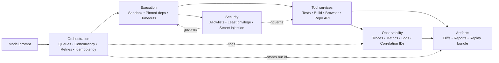

# Chapter 07 — Production AI Infrastructure

## Thesis
Production AI-first systems are distributed systems: they require orchestration, isolation, observability, caching, cost control, and reproducible environments.

Hypothesis: operational reliability depends more on the tool/runtime plane than on the model prompt. The tool/runtime plane is the execution and control surface around the model. It includes sandboxed execution environments, tool adapters (test runner, browser, repo API), and orchestration policies (queueing, concurrency limits, retries, idempotency). It also includes observability and artifacts for replay and audit. Restated: if you can reliably run tools and record what happened, you can reproduce runs and improve outcomes even when model behavior varies.

## Why This Matters
- Without isolation, tool execution becomes a security and reliability risk.
- Without observability, failures cannot be attributed or fixed systematically.
- Without cost controls, autonomy can become economically unstable.
- Operational signals: tool-failure rate, replay success rate, mean tool latency, retry rate, and spend per successful task.

Example targets and alerts (illustrative, not mandates):

| Metric | Signal to watch | Illustrative alert |
| --- | --- | --- |
| Tool-failure rate | Tool exits non-zero or returns invalid output | Alert if >2% over 1 hour for a repo; or if one tool burns its daily error budget |
| Replay success rate | “Green” runs fail to replay from recorded inputs | Alert if <95% on a weekly replay audit sample |
| Mean tool latency | Step duration inflation for stable workloads | Alert if p95 step duration doubles week-over-week |
| Retry rate | Rising retries indicate flakiness or degraded infra | Alert if retries exceed 1.2× baseline for two consecutive days |
| Spend per successful task | Cost-to-merge and wasted tokens trend upward | Alert if median cost-to-merge exceeds a cap; or wasted spend exceeds a daily share |

## System Breakdown
A diagram helps here because the tool/runtime plane has coupled components. It is not a single service. Focus on the contracts between boxes. Each box should emit stable, versioned signals for replay and debugging.

Takeaway: reliability comes from strict contracts at each boundary. Record the environment and tool versions, constrain execution, and connect every step to a run id. Then you can replay, attribute failures, and control spend.

- **Execution**: sandboxes/containers, dependency pinning, deterministic runners. Contract: identical inputs produce the same tool environment (image hash + lockfile), with a hard wall-clock timeout per step.
- **Tool services**: test runners, build systems, browsers, repo APIs. Contract: every tool call is versioned and returns structured output (exit code, stdout/stderr, and a machine-readable summary).
- **Orchestration**: queues, concurrency limits, backpressure. Contract: max concurrency is enforced (per repo/org), retries are bounded (count + backoff), and each task carries an idempotency key.
- **Observability**: traces, metrics, logs; correlation ids. Contract: every task/run has a run id and spans for each tool call, with outcome and duration recorded.
- **Artifacts**: build outputs, diffs, evaluation reports, replay bundles. Contract: store a bundle per run (inputs, tool versions, command lines, logs, diffs, and evaluation result) with a retention policy.
- **Security**: secrets handling, network egress controls, least privilege. Contract: allowlists cover tools, filesystem paths, and network egress; secrets are injected only at execution time and never written to artifacts.

## Concrete Example 1
Sandboxed tool execution for code changes.
- Trigger: a proposed patch (diff) plus a task spec (e.g., “fix failing test X”). Include the target branch SHA and a pinned environment (container image + lockfile).
- Sandbox: start an isolated runner with no ambient credentials. Mount the repo read-write and restrict filesystem + network egress to an allowlist.
- Tool calls:
  - Run a fixed sequence (format/lint → unit tests → build).
  - Enforce step timeouts (e.g., 5m/unit, 15m/build) and bounded retries for flaky steps (e.g., 2 retries with exponential backoff).
- Artifact bundle (stored per run id):
  - Persist the patch and tool call transcripts (commands, versions, exit codes).
  - Persist logs, test reports (JUnit/JSON), build outputs, and a replay manifest for the same inputs.
- Evaluation gate:
  - Promote only if required checks pass (e.g., all tests green, no new lints, diff applies cleanly).
  - Require reproducibility: either a replay succeeds at least once, or the environment hash matches a known-good cache entry.
  - On failure, generate a human-facing summary with: run id link, failed step, and top error class.
  - Include a short “what to try next” hint (e.g., rerun without cache, or inspect a specific log).

## Concrete Example 2
Cost-aware autonomy for a batch of maintenance tasks.
- Budget: per-task token/cost ceilings (e.g., $0.50 and 20k tokens) plus a batch budget (e.g., $50/day), enforced by the orchestrator.
- Strategy: fail fast on low-signal tasks (small, repetitive, or high-latency tool loops) and escalate to human review when confidence is low or blast radius is high.
- Decision policy:
  - Treat a task as “low-signal” when:
    - (a) there is no progress after N tool steps (e.g., 6),
    - (b) the same error repeats (e.g., the same stack trace twice), or
    - (c) predicted cost-to-complete exceeds remaining budget.
  - Escalate when the change touches production config or security-sensitive files.
  - Escalate when the diff exceeds a size threshold (e.g., >200 lines changed).
  - If per-task or batch budget is exceeded:
    - stop further tool calls,
    - write a short spend-and-status summary (last step, last error, run id),
    - escalate for human review.
- Measure (throughput): cost per successful task and time-to-merge.
- Measure (quality): regression rate (e.g., rollback or test failures within 24h) and “wasted spend” (tokens spent on tasks that are abandoned or escalated).

## Trade-offs
- Isolation increases safety but adds operational complexity. Default: start with containerized execution + allowlists; revisit if tool latency dominates (e.g., repeated cold starts) and you can prove tighter scoping by repo/path.
- Strong observability increases insight but raises data retention requirements. Default: use structured logs + traces with short retention for raw logs and longer retention for summaries; revisit if incident analysis regularly needs deeper raw context.
- Caching and replay improve speed but can mask nondeterminism if misused. Default: cache only deterministic steps (dependency installs keyed by lockfile, build outputs keyed by inputs). Periodically force no-cache replays; revisit if you observe drift or flaky tests that caching hides.

## Failure Modes
- **Non-reproducible runs**: environment drift makes traces hard to replay.
  - Detection: replay fails with different dependency resolutions; tool versions differ from the recorded manifest; repeated “works on runner A but not runner B” incidents.
  - Mitigation: pin images and dependencies; record tool versions and hashes in the replay manifest; run periodic “replay audits” that re-execute a sample of recent runs.
- **Leaky permissions**: tool plane has broader access than intended.
  - Detection: outbound network calls to unexpected domains; tools reading/writing outside approved paths; secrets appearing in logs or artifacts.
  - Mitigation: enforce network egress allowlists; run tools with least-privilege credentials scoped to a repo/task; add secret redaction and artifact scanning before persistence.
- **Noisy observability**: too much unstructured logging reduces signal.
  - Detection: high log volume with low queryability; incident timelines require manual grepping; key metrics (duration, retries, error class) missing from dashboards.
  - Mitigation: emit structured events for each tool call; standardize error classes and outcome codes; sample verbose logs while keeping full traces for failed runs only.

## Research Directions
- Standardized replay bundles for agent runs.
- Cost/performance models that predict optimal evaluation depth.
- Secure-by-default tool runtime primitives for autonomy.
