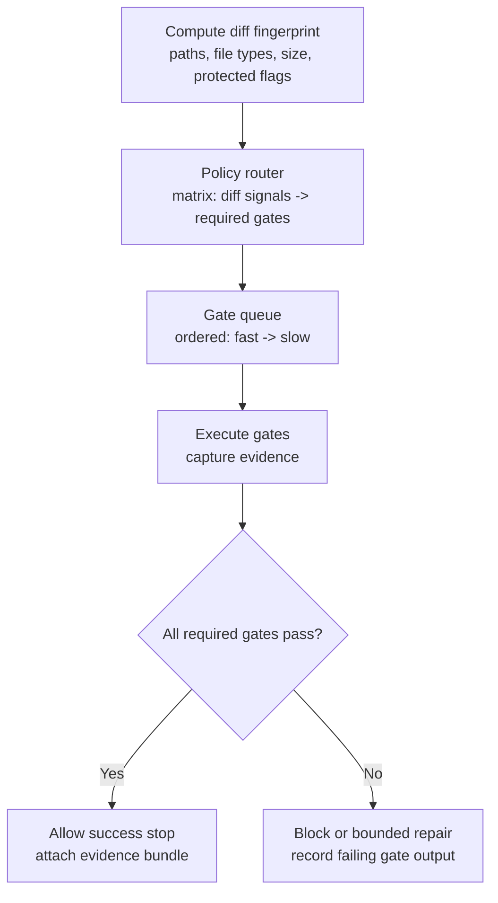

# Diff-to-Gates Router

## Context

In AI-first engineering, “done” is not a story. It is a claim backed by evidence: checks ran, passed, and outputs were captured.

A harness needs to decide which checks to run and which approvals to require. If this decision is ad hoc (“run tests sometimes”), the system becomes ungovernable.

## Problem

How do you route each proposed change to the *right* set of gates (tests, linters, security scans, approvals) in a deterministic, auditable way?

The core failure to avoid is verification roulette: two similar diffs produce different check sets, or a risky diff slips through with only a lightweight gate.

## Forces

- **Coverage vs. latency**: running the full suite every time is slow; running too little creates incidents.
- **Determinism vs. flexibility**: routing must be stable, but the system must handle new file types and repos.
- **Path sensitivity**: some surfaces (workflows, auth, deployment) deserve stronger gates.
- **Budget constraints**: the harness must stop early and report a blocked state rather than “best-effort” skipping.
- **Evasion**: if routing is purely heuristic, users and models can accidentally (or intentionally) route around gates.

## Solution

Build a router that uses the *diff* (or planned edits) as input and outputs a required gate set.

The router is a harness component, not a prompt pattern:

- It inspects paths, file types, and change magnitude.
- It selects gates from a policy matrix.
- It enforces the gates before allowing a “success” stop.
- It records gate selection and results in the trace.

A diagram clarifies the data flow. Focus on the fact that routing is deterministic: the same diff fingerprint produces the same gate set.



## Implementation sketch

### Inputs

- **Diff signals**: touched paths, file extensions, added/removed lines, file counts.
- **Protected surfaces**: path patterns (for example, CI/workflows, deploy configs, auth, secrets).
- **Action class**: read-only, patch edit, dependency change, release/deploy.
- **Environment**: can the gates run (tool availability, CI availability, network constraints).

### Policy matrix

A minimal matrix can be expressed as rules. Keep it small and composable.

Example policy rules (conceptual):

```yaml
rules:
  - when:
      any_path_matches: ["book/**.md", "docs/**.md"]
    require_gates: ["markdown_lint", "mkdocs_build"]

  - when:
      any_path_matches: ["pyproject.toml", "**/*.py"]
    require_gates: ["python_lint_or_format", "unit_tests_targeted"]

  - when:
      any_path_matches: [".github/workflows/**", ".github/**"]
    require_gates: ["workflow_validation", "security_scan"]
    require_approvals: ["governance_approval"]

  - when:
      any_path_matches: ["**/Dockerfile", "**/deploy/**", "**/k8s/**"]
    require_gates: ["container_scan", "deployment_dry_run"]
    require_approvals: ["platform_review"]
```

### Gate execution

- Order gates by cost: fast static checks first, then build/typecheck, then tests, then high-cost integration.
- For each gate, capture a minimal evidence bundle:
  - command identifier (or gate name)
  - exact command line (when applicable)
  - exit code
  - bounded stdout/stderr excerpt (or artifact pointer)
  - duration and environment metadata

### Outcomes

- **All gates pass**: the harness allows “success,” and the trace cites the evidence bundle.
- **Actionable failures**: bounded repair is allowed (for example, up to 2 iterations) but must re-run the same gates.
- **Non-actionable failures** (missing tools, flaky environment): stop as **blocked** or require a **waiver** recorded in a ledger.

## Concrete examples

### Example 1: Markdown-only change routes to documentation gates

Diff: edits only `book/chapters/02-harness-engineering.md`.

- Router selects: `markdown_lint`, `mkdocs_build`.
- No approvals.
- Success requires evidence: `mkdocs build` exit code 0.

This prevents “looks fine” completions when the doc build is broken.

### Example 2: Protected-path change routes to approval + security gates

Diff: edits `.github/workflows/ci.yml`.

- Router selects: `workflow_validation`, `security_scan`.
- Approvals required: governance approval.
- Without approval token, the patch tool is rejected before any write.

This prevents stealth changes to the CI security boundary.

## Failure modes

- **Over-broad routing**: too many diffs trigger expensive gates; teams disable the router.
  - Mitigation: keep protected-path rules narrow; use targeted tests when possible.
- **Under-routing**: risky diffs trigger only lightweight checks.
  - Mitigation: treat protected surfaces as first-class signals; keep a default “unknown surface” gate.
- **Non-deterministic signals**: routing depends on model text, not observed artifacts.
  - Mitigation: route on diff + path + action class, not on natural-language intent.
- **Gate skipping**: the harness stops success without evidence.
  - Mitigation: enforce evidence-first completion in the kernel; success requires gate artifacts.
- **Policy drift**: routing logic changes without review.
  - Mitigation: version the policy matrix, require review for protected-surface rules.

## When not to use

- Early exploratory drafts where the acceptance signal is human judgment and checks add little value.
- Projects without stable, runnable gates (no tests/build/lint) and no appetite to add them.
- Environments where you cannot reliably compute diffs (for example, tool surface does not provide patches or file lists).
