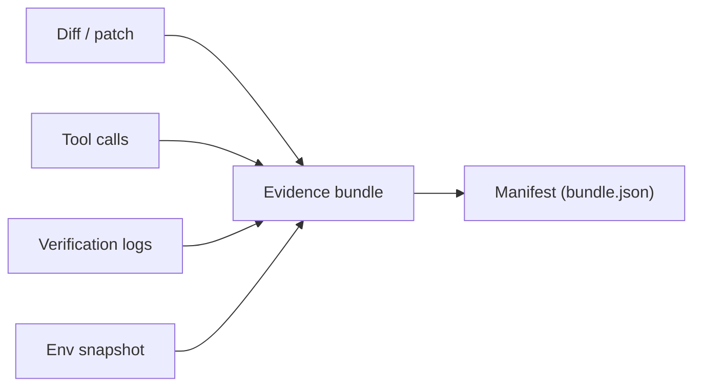

# Evidence Bundle Standard (One Artifact, Always)

## Context

In an autonomous-kernel workflow, “done” is not a narrative claim. It is a claim backed by evidence: patches applied, checks run, and outputs captured. In practice, evidence tends to fragment across terminal scrollback, CI logs, local artifacts, and ad-hoc notes.

This pattern standardizes a single, always-produced artifact that captures the minimum evidence needed to audit, reproduce, and compare runs. It is designed to align with evaluation/traces: every run emits a bundle, even when it fails.

## Problem

How do you make every run auditable and replay-friendly without teaching every engineer (and every agent) a different “where did you put the logs?” ritual?

When evidence is scattered:

- You cannot reliably answer: what changed, what checks ran, and what passed.
- You cannot compare runs over time (drift) because the record format varies.
- You cannot debug failures quickly because the first step is reconstructing what happened.

## Forces

- **One artifact vs. many artifacts**: a single bundle improves discoverability, but risks becoming large and noisy.
- **Completeness vs. cost**: capturing more data improves debugging, but increases runtime, storage, and redaction effort.
- **Local runs vs. CI runs**: local evidence is easiest to collect, but CI evidence is often the source of truth for merge gates.
- **Privacy and secrets**: logs frequently contain tokens, paths, or customer data; bundles must be redactable.
- **Standardization vs. flexibility**: a rigid schema improves tooling, but must allow per-repo variations in checks.

## Solution

Define an “evidence bundle” as a single directory (or archive) that always contains:

- A small manifest (machine-readable) describing the run.
- A patch/diff representation of changes (or a pointer to the diff).
- The verification record: commands, exit codes, and captured outputs.
- A minimal environment snapshot: versions and identifiers needed for replay.

Prefer a rule that is easy to enforce: *a run cannot stop “success” unless it has produced an evidence bundle id.* Also produce a bundle on failure/blocked outcomes, so incident review doesn’t depend on intent.

A diagram helps because the core idea is consolidation: multiple evidence streams become one bundle with a manifest.



## Implementation sketch

Minimum required files (conceptual):

- `bundle.json` (manifest)
- `diff.patch` (or `changed_files.json` + checksums)
- `checks.jsonl` (one record per check)
- `stdout/` and `stderr/` captures (bounded)

Recommended storage layout:

- `artifacts/runs/<run_id>/bundle/...`

Minimal manifest schema (example):

```json
{
  "run_id": "2026-02-23T19-55-12Z_8f3c",
  "repo": {
    "root": "/path/to/repo",
    "commit": "<git sha>",
    "dirty": true
  },
  "kernel": {
    "version": "0.1",
    "budgets": {"max_steps": 20, "max_minutes": 5}
  },
  "outcome": "verified",
  "changed_files": [
    {"path": "book/patterns/x.md", "sha256_after": "..."}
  ],
  "verification": {
    "required_checks": ["markdownlint", "mkdocs_build"],
    "status": "pass"
  },
  "redaction": {
    "policy": "default",
    "notes": "stdout/stderr truncated to 64KB per file"
  }
}
```

Verification record format (append-only JSONL):

```json
{"check":"markdownlint","command":"npx markdownlint-cli2 --fix --config .markdownlint-cli2.jsonc book/","exit_code":0,"duration_ms":1823}
{"check":"mkdocs_build","command":"uv run mkdocs build","exit_code":0,"duration_ms":9145}
```

Operational rules that make the standard enforceable:

- **Always emit**: bundle creation is not conditional on success.
- **Bounded capture**: cap stdout/stderr per command; store full logs only when explicitly enabled.
- **Stable naming**: `run_id` must be unique and sortable; include timestamp + short random.
- **Redaction pass**: run a configurable redact step (regex-based at minimum) before persisting bundles.
- **Pointer-friendly**: if a diff is huge, store a pointer to a git range or artifact URL, but keep checksums in the manifest.

## Concrete examples

### Example 1: Updating a pattern page with formatting gates

A documentation agent adds a new section to a pattern page and must prove formatting and build integrity.

Evidence bundle contents:

- `diff.patch`: shows edits to one markdown file.
- `checks.jsonl`:
  - `npx markdownlint-cli2 --fix --config .markdownlint-cli2.jsonc book/` exit `0`
  - `uv run mkdocs build` exit `0`
- `bundle.json`: records `outcome: verified` and file checksum(s).

Result: review is trivial because the bundle contains the patch and the exact two acceptance commands with exit codes.

### Example 2: Bugfix with a failing-then-passing test

A code change fixes a crash. The first test run fails; after a patch, tests pass.

Evidence bundle contents:

- `checks.jsonl` includes two entries for the same check:
  - `pytest -q` exit `1` with truncated stderr excerpt showing the failing assertion.
  - `pytest -q` exit `0`.
- `stdout/pytest_1.txt` and `stderr/pytest_1.txt` capture the failure signature.
- `diff.patch` contains both the code fix and the updated test.

Result: later investigators can see the precise failure signature, the repair, and the passing verification in one place.

## Failure modes

- **Bundle inflation**: bundles grow until they are unusable.
  - Mitigation: strict size budgets; store only summaries by default and keep pointers to full logs.
- **“Manifest only” bundles**: teams create bundles that omit diffs or check outputs, defeating the purpose.
  - Mitigation: enforce a minimum bundle contract (diff/pointer + check records + exit codes).
- **Secret leakage**: stdout/stderr captures contain tokens.
  - Mitigation: redaction pass + allowlist what is captured + configurable “no-log” checks.
- **Non-comparable runs**: fields differ across runs, preventing drift analysis.
  - Mitigation: keep a stable schema and version it (`schema_version`) so tooling can evolve safely.
- **Evidence without provenance**: bundle lacks repo SHA, tool versions, or command lines.
  - Mitigation: require a minimal environment snapshot and record exact commands.

## When not to use

- Extremely low-risk, short-lived drafts where no verification is expected and storage overhead dominates.
- High-sensitivity domains where storing logs is prohibited and you cannot reliably redact.
- Environments without a stable artifact store; if bundles are routinely lost, a “standard” becomes a false promise.
