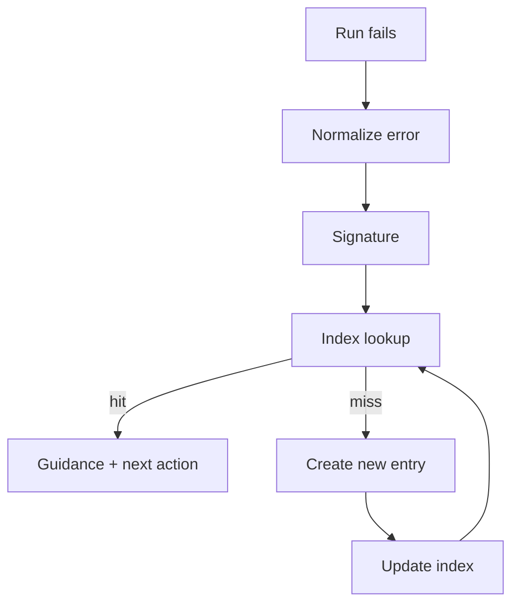

# Failure-Signature Index

## Context

Autonomous kernels generate traces: tool calls, errors, and verification outcomes. Over time, most operational pain comes from a small number of recurring failures (missing dependencies, policy denials, flaky checks, environment drift), but these failures are usually recorded as raw logs.

A failure-signature index converts raw failures into a stable, searchable layer: a normalized signature paired with triage guidance, known causes, and the smallest next action. This pattern complements the evaluation-and-traces chapter by turning “logs” into a durable debugging interface.

## Problem

How do you make failures diagnosable and attributable across many runs without relying on tribal knowledge and ad-hoc grep?

Without an index:

- The same failure is re-triaged repeatedly.
- Root causes are misattributed (model error vs tool error vs harness policy vs flaky test).
- Teams cannot measure whether the system is improving because failure categories are unstable.

## Forces

- **Stability vs. specificity**: signatures must be stable across minor log changes, but specific enough to be actionable.
- **Privacy vs. usefulness**: raw stderr can contain secrets or customer data; normalization must avoid persisting sensitive text.
- **Coverage vs. effort**: indexing every failure is expensive; focusing on “top N” recurring failures yields better ROI.
- **Collisions**: over-normalization can cause unrelated failures to map to one signature.
- **Evolution**: signatures and fixes change as code and tooling change; the index must be versioned.

## Solution

Normalize each failure into a compact signature and maintain an index entry that answers:

- What category is this? (validation, timeout, policy, runtime)
- What layer likely caused it? (model, tool, harness, eval)
- How do you reproduce it?
- What is the smallest next action?
- What evidence should the run include next time?

A diagram helps because the pattern has two distinct flows: recording from traces and lookup during triage.



## Implementation sketch

Signature computation should be deterministic and bounded.
A practical approach is to store a short normalized excerpt plus a hash.

Normalization heuristics (example):

- Strip timestamps, absolute paths, ANSI color codes.
- Keep only the first ~20 lines of stderr.
- Extract a “headline” (exception type + key message).
- Optionally include top stack frame file + line (if stable).

Signature payload (conceptual):

```text
kind=runtime
layer=tool
headline=ModuleNotFoundError: No module named 'mkdocs'
frame=python:-m mkdocs
```

Then compute `signature_id = sha256(payload)`.

Index storage format (YAML example):

```yaml
schema_version: 1
signatures:
  - signature_id: "sha256:..."
    headline: "ModuleNotFoundError: No module named 'mkdocs'"
    kind: "runtime"
    layer: "tool"
    severity: "blocking"
    repro:
      command: "uv run mkdocs build"
      notes: "Ensure .venv exists and dependencies installed"
    next_action: "Run `uv sync` then retry"
    evidence_to_capture:
      - "python version"
      - "uv lock state"
    owners: ["tooling"]
    last_seen_after: "2026-02-23"
```

Integration points:

- **Trace writer**: on failure, emit `normalized_error` fields (kind/layer/headline/signature_id).
- **Verifier**: attach signature_id to failing checks.
- **Triage tooling**: provide `lookup(signature_id)` that prints the index entry.
- **Index maintenance**: update entries when root causes change; keep `supersedes` links when signatures evolve.

A minimal governance rule keeps the index reliable:

- New entries must include `repro.command` and `next_action`.
- Entries must be reviewable (PR) and versioned.
- Retire stale entries by date (`last_seen_after`) or when superseded.

## Concrete examples

### Example 1: Policy denial on protected paths

A run attempts to edit a protected configuration file and the tool router rejects it.

Normalized payload:

- kind: `policy`
- layer: `harness`
- headline: `PolicyDenied: protected path requires approval`

Index entry guidance:

- Repro: rerun the same patch attempt.
- Next action: request an approval artifact (or move edit to an allowed file).
- Evidence to capture: the exact file path(s) blocked and the policy name.

Outcome: the agent stops “blocked” with the smallest next action instead of attempting risky workarounds.

### Example 2: Repeated markdownlint failure signature

A documentation run fails consistently with a formatting rule.

Normalized payload:

- kind: `validation`
- layer: `eval`
- headline: `MD013/line-length: Line length exceeds 120`

Index entry guidance:

- Repro: `npx markdownlint-cli2 --config .markdownlint-cli2.jsonc book/`.
- Next action: apply `--fix` or reflow the specific paragraph; avoid adding long unbroken URLs.
- Evidence to capture: the file path and rule id.

Outcome: repeated formatting failures become easy to fix and easy to measure.

## Failure modes

- **Over-normalization collisions**: unrelated errors map to the same signature.
  - Mitigation: include one stable frame or rule id; keep an escape hatch for “split signature.”
- **Under-normalization churn**: small log changes create new signatures.
  - Mitigation: strip paths/timestamps and hash only normalized payload.
- **Sensitive data leakage**: headlines include secrets.
  - Mitigation: redaction before indexing; store hashes and controlled excerpts.
- **Stale guidance**: the “next action” no longer works after tooling changes.
  - Mitigation: require `last_verified_after` or periodic re-verification via canary tasks.
- **Index becomes a dumping ground**: too many low-value entries.
  - Mitigation: focus on high-frequency failures and “blocking” severities; prune aggressively.

## When not to use

- Very small projects with low run volume where ad-hoc triage is cheaper.
- Systems where logs cannot be stored even in normalized form.
- Environments where failures are dominated by unique, one-off issues (the index won’t amortize).
