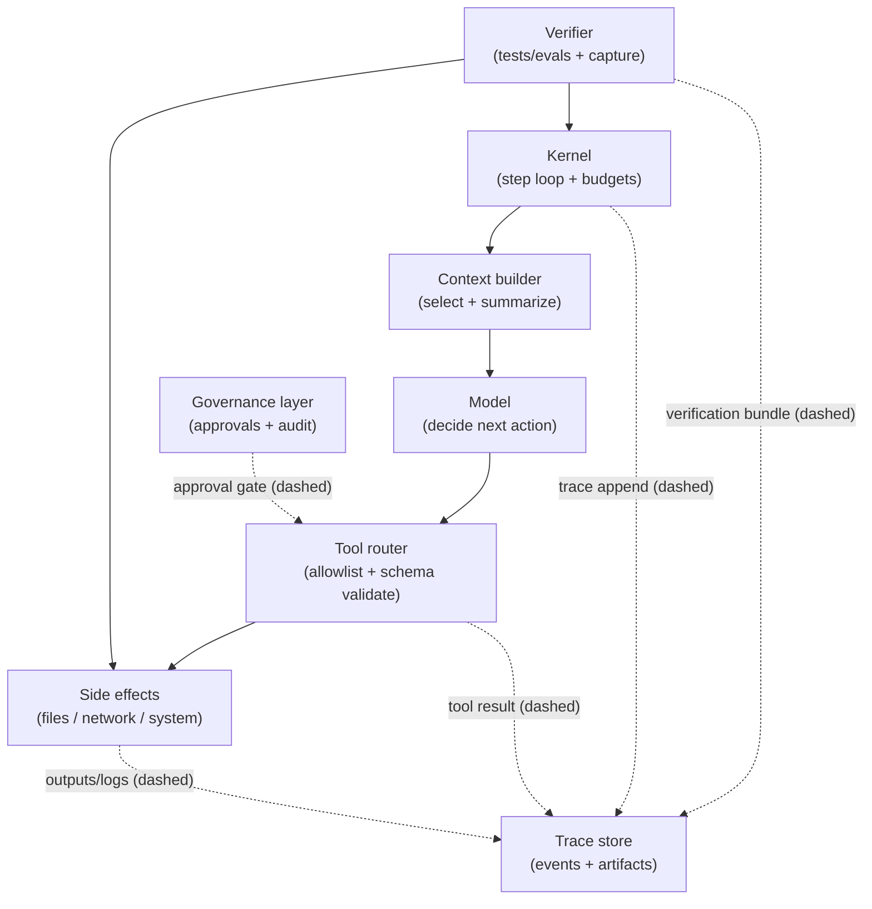

# Harness Design Patterns

## Context

A model alone is a general-purpose component. Production behavior is shaped by the harness: prompts, tools, memory, budgets, verification, and traceability.

In this chapter, “agent” means the model-driven decision-maker. It is the part that chooses actions and generates outputs. “Harness” means everything around the agent that constrains, records, and verifies actions. That includes the step loop, tool boundary, context construction, budget enforcement, and the evidence required before “done.”

A harness is *governable* when run artifacts can answer: what was allowed, what was attempted, what changed, what was proven, and who approved high-risk capability.

## Problem

How do you design a harness that is reliable, debuggable, and governable without building a fragile tangle of special cases?

More concretely, how do you get repeatable outcomes from bounded iteration? How do you get explainable outcomes from traces and errors? How do you get safe outcomes from tool gating and verification, while keeping enough capability for real repo tasks?

## Forces

- **Constraints vs. coverage**: adding constraints improves safety but can reduce task coverage.
  - Mitigation: enforce constraints in the kernel/router (budgets, tool allowlists). Do not rely on prompt-only rules.
  - Over-optimizing risk: narrow allowlists and strict stop gates can force manual “escape hatches.” That reduces auditability.
- **Tools vs. surface area**: more tools increase capability but enlarge the debug and governance surface.
  - Mitigation: prefer a small set of composable, typed tools. Keep a consistent error model and idempotency.
  - Over-optimizing risk: tool sprawl creates overlapping affordances (“edit_file” vs “apply_patch” vs “write_file”). Traces become harder to interpret.
- **Memory vs. drift/privacy**: continuity improves with memory, but so do drift and data handling risks.
  - Mitigation: narrow context construction with explicit selection limits. Treat summaries as *derived* artifacts, not source of truth.
  - Over-optimizing risk: long-term memory can preserve outdated assumptions. It also increases retention and redaction obligations.
- **Automation vs. blast radius**: stronger automation improves throughput but increases the impact of failures.
  - Mitigation: separate plan/execute/verify duties. Add governance gates for high-risk tools or wide-scope edits.
  - Over-optimizing risk: automatic execution without approvals or rollback can amplify a single bad decision. The impact can be repo-wide.
- **Observability vs. cost**: better tracing and verification cost time and compute.
  - Mitigation: require a minimal, standardized verification bundle. Record commands, exit codes, diffs, and checksums.
  - Over-optimizing risk: heavyweight evals and extensive instrumentation can consume the budget. Little time remains to fix what the eval found.

## Solution

Use a small set of recurring harness patterns that are easy to audit and compose.

Together, these patterns form a cohesive system. Define a strict side-effect boundary (tools). Bound the process (budgets). Require proof (evidence). Keep inputs minimal (narrow context). Prevent phase-skipping (separation of duties).

End-to-end mini-walkthrough (how the patterns compose in a typical repo edit):

- The run begins in **Plan** mode and produces a concrete plan. No side effects are permitted. *(Pattern 5)*
- A narrow working set is constructed (for example, 2–4 files) plus a summary of prior steps. *(Pattern 4)*
- In **Execute** mode, the agent proposes a patch. Mutations happen only via a typed patch tool with a structured result and checksum. *(Pattern 1)*
- The kernel enforces iteration budgets (steps/time/cost). On exhaustion, the run stops with a partial report and the trace. *(Pattern 2)*
- In **Verify** mode, checks are run and recorded. “Done” is accepted only if verification artifacts exist. *(Pattern 3)*

### Pattern 1: Typed Tool Boundary

- **Idea**: tools are the only way to cause side effects, and each tool has a typed schema with explicit errors.
- **Why it works**: reduces ambiguity and makes traces auditable.
- **Example**: `create_file(path, content)` returns `created | updated | no_op`, plus a checksum.

### Pattern 2: Budgeted Control (Steps/Time/Cost)

- **Idea**: the kernel enforces budgets; the model cannot override them.
- **Why it works**: turns open-ended iteration into a bounded process.
- **Example**: max 20 steps or 5 minutes; on exhaustion, stop with a partial report.

### Pattern 3: Evidence-First Completion

- **Idea**: “done” requires verifiable evidence (tests run, diffs applied, outputs captured).
- **Why it works**: prevents completion based on plausibility alone.
- **Example**: stop is rejected unless verification artifacts exist in the trace.

### Pattern 4: Narrow Context Construction

- **Idea**: select only the files needed for the next action; summarize the rest.
- **Why it works**: reduces context bloat and keeps constraints salient.
- **Example**: open 2–4 files max, keep a rolling summary of prior steps.

### Pattern 5: Separation of Duties (Plan vs. Execute vs. Verify)

- **Idea**: treat these as distinct phases with distinct constraints.
- **Why it works**: limits the ability to bypass controls (for example, editing policies during execution).
- **Example**: planning cannot call side-effect tools; verification cannot modify code.

### Pattern 6: Action-Class Gating Matrix

- **Idea**: classify work by action class (read-only, patch edit, dependency change, release), then require a minimum set of gates per class.
- **Why it works**: it prevents “verification roulette” where different runs pick different checks, and it makes skipped checks auditable.
- **What to record**: the action class, required checks, the selection reason for each check, and an explicit `skipped_reason` when something is not runnable.

A minimal action-class set:

- **Read-only** (search/view/list): permission gate only; record `skipped_reason: "read_only_action"` for correctness/quality.
- **Patch edit** (code/docs diff): protected-path gate + quality gate + correctness gate (targeted tests) unless explicitly waived.
- **Dependency change** (lockfile / adds): secret scan + protected-path gate + correctness gate (import/targeted tests).
- **Release/deploy**: explicit approval + full suite/contract tests + secret scan.

### Pattern 7: Protected Paths + Explicit Approvals

- **Idea**: treat sensitive paths as protected and require an explicit approval artifact to modify them.
- **Why it works**: it prevents silent privilege expansion (the agent “discovers” it can edit workflows, prod configs, or secrets) and creates review routing that matches risk.
- **Mechanics**:
  - Tool router rejects patches touching protected paths unless an approval token is present.
  - Trace records approval token + approver identity + timestamps.
  - CI re-validates the merged diff and blocks merge if the approval artifact is missing.

### Pattern 8: Golden Tasks + Drift Detection

- **Idea**: keep a small set of pinned “golden tasks” and track their metrics over time to detect drift.
- **Why it works**: it turns “the agent feels worse lately” into measurable signals tied to fixed inputs.
- **Pin what matters**: prompt/attachments, repo SHA (or fixture repo), harness version, budgets, and required gates.
- **Track**: iterations-to-pass, gate failure rate, and stop-reason distribution (e.g., “budget exceeded” becoming dominant).

### Pattern 9: Normalized Errors for Attribution

- **Idea**: normalize failures into stable categories so you can attribute incidents to the right layer.
- **Why it works**: the most important debugging question is usually “model mistake vs tool failure vs harness bug vs missing test,” and raw logs make that hard.
- **Minimal fields**: `error_kind` (validation/timeout/runtime/policy), `failure_signature` (stable excerpt), `layer` (model/tool/harness/eval), and `repro_command` when applicable.

### Pattern 10: Waivers as First-Class Outcomes

- **Idea**: if a required gate cannot run, that is not a pass; it is an explicit waiver with recorded risk.
- **Why it works**: it preserves auditability and makes “we shipped without tests” visible and measurable.
- **Waiver record**: which gate was waived, why it was not runnable, what alternative check ran (if any), what risk remains, and who approved the waiver.

## Implementation sketch

Minimal harness components:

- **Kernel**: step loop, budgets, cancellation/timeouts, trace append.
- **Tool router**: allowlist + argument validation + consistent error model + idempotency support.
- **Context builder**: file selection + summarization policy + retrieval policy.
- **Verifier**: runs evals/tests and records outputs.
- **Governance layer**: approvals for high-risk tools, audit logs, retention/redaction rules.

A diagram helps here because the harness is mostly about boundaries and evidence flow. It shows where side effects can occur. It also shows where gates enforce approvals and verification.

To make “evidence-first” operational, define the minimal verification bundle that the Verifier must emit into the trace. This should happen even on failure. At minimum:

- **What ran**: command lines or eval identifiers, plus working directory and relevant env flags (redacted as needed).
- **What happened**: exit code, duration, and a bounded stdout/stderr capture (or a pointer to stored logs).
- **What changed**: patch/diff identifiers and file-level checksums (before/after) for any mutated files.
- **What was decided**: a final outcome marker such as `verified` or `blocked`, plus reproduction steps when blocked.

A small harness configuration can be expressed as a policy document (conceptual):

```yaml
tools:
  allowlist: [read_file, grep_search, apply_patch, get_errors, run_in_terminal]
budgets:
  max_steps: 20
  max_minutes: 5
stop_gate:
  require_verification: true
  acceptable_outcomes: ["verified", "blocked"]
```

A diagram helps here because the harness is mostly about *boundaries* (who can do what) and *evidence flow* (what must be recorded before completion). As you read it, focus on two things: where side effects can occur, and where gates enforce approvals and verification.



In the diagram, solid arrows represent control/data flow for the run (what happens next), while dashed arrows represent trace and gate signals (what must be recorded or approved). The key takeaway is that side effects are reachable only through the tool router, and completion is reachable only after the verifier has produced evidence into the trace.

### Concrete example

Repo task agent that edits documentation:

- Tools: `read_file`, `grep_search`, `apply_patch`, `get_errors`.
- Budgets: 15 steps, 3 minutes.
- Stop gate: markdown checks (or at minimum a syntax/lint pass) must be clean, or the run stops as “blocked” with reproduction steps.

Trace snippet (expected high-level events, in order):

- `plan_created` (includes constraints and intended files)
- `files_selected` (file list + selection rationale)
- `patch_applied` (diff id + checksums)
- `checks_run` (commands + exit codes + captured output pointers)
- `run_outcome: verified | blocked` (plus reproduction steps if blocked)

## Failure modes

- **Tool sprawl**: too many overlapping tools; selection becomes inconsistent and hard to audit.
  - Typical symptom: similar tasks produce different tool sequences, making runs hard to compare.
  - Mitigation: Pattern 1 (Typed Tool Boundary) with a small, composable tool set and consistent return types.
- **Hidden side effects**: tools mutate state without reporting it; traces become misleading.
  - Typical symptom: verification fails but there is no record of what changed.
  - Mitigation: Pattern 1 (typed results + checksums) plus Pattern 3 (evidence bundle includes “what changed”).
- **Context bloat**: prompts include too much content; constraints and acceptance criteria are diluted.
  - Typical symptom: the agent “forgets” budgets or acceptance criteria because they are drowned out by irrelevant text.
  - Mitigation: Pattern 4 (Narrow Context Construction) with explicit file limits and rolling summaries.
- **Policy bypass**: weak allowlists or validation enable unintended actions.
  - Typical symptom: the agent discovers an unreviewed capability via a permissive tool surface (“run_shell” becomes a universal escape hatch).
  - Mitigation: Pattern 1 (tool allowlists + schema validation) and Pattern 5 (phase constraints that prevent execution-time policy edits).
- **Unmeasured changes**: no evals/verification; regressions ship silently.
  - Typical symptom: “looks good” completions that fail when rerun or merged.
  - Mitigation: Pattern 3 (Evidence-First Completion) with a stop gate that requires recorded verification.
- **Over-coupling**: harness depends on brittle prompt wording instead of enforceable kernel/router constraints.
  - Typical symptom: small wording changes in system prompts shift behavior dramatically.
  - Mitigation: Pattern 2 (Budgeted Control) and Pattern 1 (enforced tool boundary) so critical constraints are not prompt-dependent.

## When not to use

- Single-purpose automation where a deterministic script is simpler.
- One-off exploratory work where harness engineering overhead dominates.
- Systems without ownership/ops capacity to maintain tools, budgets, verification, and incident response.
