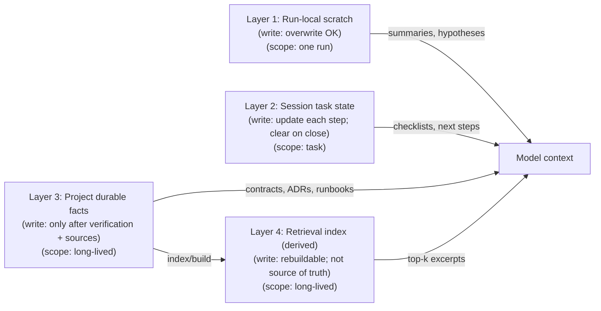

# Memory Architectures

## Context

Agents are limited by context window, variability across runs, and the need to operate over long-lived projects. Memory mechanisms can improve continuity, but they also introduce drift, privacy risk, and debugging complexity.

In this chapter, “memory” means persisted or semi-persisted information that can influence a later run. “State” is the structured record of the current task’s progress. It answers: what’s done, what’s next, and what’s blocked. “Retrieval” selects candidate information from a larger corpus and brings it into the current context. Retrieval results are suggestions, not authoritative facts.

## Problem

How do you add memory so the system remains reproducible and governable?

A useful answer must preserve two properties:

- **Reproducibility**: given the same code and inputs, you can explain which memories were consulted and why they mattered.
- **Governability**: you can audit, version, and delete memory items by rule (scope, source, and time), without relying on implicit behavior.

## Forces

- **Recall vs. precision**: retrieving more increases coverage but adds noise.
- **Freshness vs. stability**: updating memory improves relevance but can rewrite history.
- **Privacy vs. utility**: storing more can leak sensitive data and expand retention obligations.
- **Debuggability**: implicit retrieval is harder to reason about than explicit records.
- **Versioning**: memory must evolve with code; unversioned memory becomes a hidden dependency.

How to choose (practical heuristics):

- If mistakes are costly, bias toward **precision over recall**: retrieve fewer items, require source confirmation, and prefer explicit pointers (file paths, trace IDs) over paraphrased “facts.”
- If work spans days/weeks, bias toward **stability over freshness** for durable memory: append new entries rather than mutating old ones; treat “updates” as new, versioned records.
- If data sensitivity is unclear, bias toward **utility via derived retrieval**: store less durable content; keep indexes rebuildable; rely on short-lived state plus links to existing sources.

## Solution

Prefer layered, explicit memory with clear scopes, schemas, and write rules.

A diagram helps because the key idea is the *relationship* between layers. Focus on the arrows (what feeds the model) and the “write rule” labels (what is allowed to persist). The goal is to make persistence explicit and reviewable.



Layer boundaries (inputs, outputs, authority):

- **Layer 1 (scratch)**: input is the current prompt + tool outputs; output is short notes and summaries; not authoritative.
- **Layer 2 (session state)**: input is task steps and decisions; output is a checklist and verification status; authoritative for *task progress* only.
- **Layer 3 (durable facts)**: input is verified outcomes plus sources; output is reviewable records with provenance; authoritative when sources are valid.
- **Layer 4 (retrieval index)**: input is documents/issues/traces; output is ranked pointers/excerpts; derived and never authoritative.

The takeaway: make “what the agent knows” a controlled blend of volatile scratch, explicit task state, verified durable facts, and derived retrieval. Each layer has different write permissions.

### Layer 1: Run-local working memory (scratch)

- **What**: transient notes, intermediate calculations, short summaries.
- **Scope**: one run.
- **Write rule**: always safe to overwrite; never treated as durable truth.
- **Example**: “Files touched: A, B. Hypothesis: failing test caused by null handling.”

### Layer 2: Session memory (task state)

- **What**: structured state for a multi-step task (checklists, open questions, next steps).
- **Scope**: until task completion.
- **Write rule**: update on each step; clear on task close.
- **Example**: a JSON task record containing acceptance criteria and verification status.

### Layer 3: Project memory (durable facts)

- **What**: stable, reviewable records: architecture decisions, interface contracts, runbooks.
- **Scope**: long-lived.
- **Write rule**: write only after verification passes and with a source-of-truth reference.
- **Example**: ADR-style entries with links to code and traces.

### Layer 4: Retrieval index (searchable corpus)

- **What**: embeddings or keyword index over docs/issues/traces.
- **Scope**: long-lived, but treated as *derived* data.
- **Write rule**: rebuildable; never the only place a critical fact exists.
- **Example**: “retrieve top 5 related incidents” feeding short excerpts into context.

## Implementation sketch

Write rules that keep memory auditable and safe:

Write gates:

- Only write durable memory after verification passes.
- Treat retrieval as a *hint*; require confirmation against sources for critical claims.

Provenance & schemas:

- Store sources (file paths, URLs, trace IDs, commit hashes) with each memory item.
- Separate schemas for different types of memory: facts, decisions, preferences, open questions.
- Version memory alongside the system (or tie it to a release identifier).

Retention & redaction:

- Support redaction and retention policies (delete by scope, delete by source, delete by time).

Example durable-memory record schema (conceptual):

```json
{
  "type": "decision",
  "title": "Prefer golden tests for CLI help output",
  "status": "accepted",
  "sources": ["docs/cli.md", "trace:2026-02-18T10:14Z"],
  "rationale": "Help output is user-facing and easy to regress",
  "verified_by": ["npm test", "snapshot update reviewed"],
  "created_at": "2026-02-18"
}
```

### Concrete example

Bugfix agent memory layout:

- **Run-local**: stack trace notes and hypotheses.
- **Session**: checklist of reproduction steps + test plan + files changed.
- **Project**: “Root cause and fix” note linked to the failing test and the patch.
- **Retrieval**: search prior traces for similar failure signatures.

End-to-end walkthrough (one bugfix, four layers):

1) **Retrieval index (Layer 4) proposes candidates**  
   The agent runs “retrieve top 5 related incidents” using the failing test name and a short error signature (e.g., `TypeError: cannot read property 'id' of null`). It gets excerpts like:
   - an incident note mentioning “null user during CLI parsing”
   - a PR discussion that links to `src/parse.ts`
   These excerpts are treated as leads. The agent follows the links and re-checks the current sources.

2) **Run-local scratch (Layer 1) captures hypotheses, not conclusions**  
   The agent writes volatile notes such as:
   - “Hypothesis A: null handling in parse.ts”
   - “Hypothesis B: fixture missing `id` field”
   - “Next checks: reproduce with `npm test -t parse`”
   If the hypothesis changes after inspecting sources, the scratch note is overwritten.

3) **Session task state (Layer 2) makes progress and verification explicit**  
   The agent maintains a task record (checklist-style) like:
   - Repro step captured: `npm test -t "parse handles null user"` ✅
   - Minimal failing input recorded (fixture path) ✅
   - Fix implemented in `src/parse.ts` ⬜
   - Regression test added/updated ⬜
   - Verification rerun (tests/lint) ⬜
   This is the place to see what was done and what remains. It is cleared when the task closes.

4) **Project durable facts (Layer 3) is written only after verification**  
   After tests pass, the agent writes a durable note (ADR/runbook/“root cause” entry) that includes:
   - the root cause (“parser assumed non-null user; null can occur when flag X is omitted”)
   - the fix (“guard + explicit error message”)
   - sources (commit hash, file paths, failing test name, trace ID)
   This is what makes future runs governable. The durable entry points back to artifacts that can be re-checked.

Operationally, this keeps reproducibility. You can replay the run by inspecting the sources, seeing which retrieval hits were used, and verifying that durable memory was gated on passing checks.

Second scenario (non-bugfix): onboarding and runbook lookup:

- **Retrieval (Layer 4)**: query “deploy rollback steps” and “service X runbook” and pull top-k links only.
- **Scratch (Layer 1)**: jot “candidate runbooks: docs/runbooks/rollback.md, incident-2025-11-03” and open questions.
- **Session state (Layer 2)**: track “confirmed steps in staging” and “who reviewed,” plus exact commands run.
- **Durable facts (Layer 3)**: after a staging drill passes, record an updated runbook entry with sources (PR link and command transcript). Include a drill run ID (e.g., `DRILL-2026-02-22`) and a pass criterion (e.g., rollback script exits 0).

## Failure modes

- **Stale memory**: outdated assumptions persist after refactors; fixes target the wrong code. Mitigation: store **sources and version identifiers** with durable entries, and treat retrieval as a hint that must be confirmed against current files/traces.
- **Memory poisoning**: incorrect entries are stored as facts and bias future actions. Mitigation: apply a **write gate** (only after verification) and use **separate schemas** so “open questions” and “hypotheses” do not masquerade as facts.
- **Over-retrieval**: too many irrelevant items drown the signal and dilute constraints. Mitigation: keep retrieval **top-k and source-linked**, and require confirmation against sources for critical claims rather than pasting large context blobs.
- **Silent mutation**: memory is updated without review; history is effectively rewritten. Mitigation: prefer **append-only, versioned durable records** tied to releases/commits instead of in-place edits.
- **Unversioned dependency**: behavior depends on memory that is not tied to code/version. Mitigation: **version memory alongside the system** (or bind to release identifiers) so the dependency is explicit and reviewable.
- **Privacy leakage**: sensitive content is stored, retrieved, or logged without appropriate handling. Mitigation: enforce **retention/redaction policies** (delete by scope/source/time) and keep derived indexes rebuildable so deletion is enforceable.

## When not to use

- Short-lived tasks where the context window is sufficient.
- High-sensitivity domains without a clear retention/redaction policy.
- Systems that require strict reproducibility but cannot version memory with code.

Fallback for strict reproducibility: rely on explicit logs + artifacts (commands, traces, patches, test reports) and keep “memory” limited to pointers into those sources.
