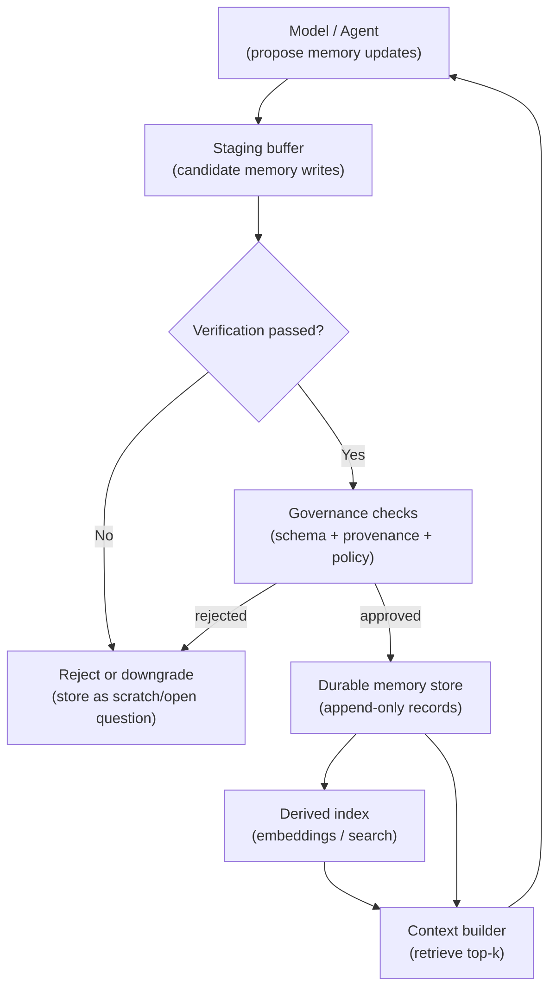

# Memory Write Barrier (Verified-Only Durable Memory)

## Context

Agents benefit from memory: durable records can prevent repeated mistakes, preserve decisions, and speed up multi-day work. But “memory” is a side-effect: once it persists, it can bias future runs, expand retention obligations, and become a hidden dependency.

In most real systems, the dangerous failure mode is not *lack of memory* but *incorrect memory with authority*. A single unverified entry (“the API supports X”, “this command is safe”) can propagate into future runs as a false constraint or a false fact.

This pattern is also called **Memory Write Gate** or **Verified-Only Durable Memory**.

## Problem

How do you let an agent benefit from durable memory without letting unverified guesses, hallucinations, or transient hypotheses become long-lived “facts”?

More concretely:

- How do you prevent durable memory from being updated during uncertain, mid-investigation steps?
- How do you ensure durable entries are traceable to sources and verification evidence?
- How do you support deletion, redaction, and correction without rewriting history?

## Forces

- **Usefulness vs. safety**: writing more memory improves continuity but increases the chance of storing wrong or sensitive information.
- **Speed vs. verification**: waiting for checks slows throughput; skipping checks increases drift.
- **Precision vs. recall**: strict gates may reject valuable but partially verified information; loose gates store noise.
- **Authority leakage**: retrieval systems often surface durable memory with high confidence (“we decided…”) even when it was only a hypothesis.
- **Governance requirements**: audit, retention, and redaction become harder when memory is mutable or lacks provenance.
- **System coupling**: if memory depends on the current code shape, refactors can invalidate it.

## Solution

Introduce a **write barrier** between the agent’s proposed memory updates and the durable memory store.

- The agent may write freely to **scratch** and **task state**.
- Durable memory is written only through a **gate** that requires:
  - **verification evidence** (tests/evals/checks or a domain-appropriate validation),
  - **provenance** (source pointers like file paths, trace IDs, commit hashes, URLs), and
  - **a schema** that separates facts/decisions from hypotheses and open questions.

A short diagram helps because the pattern is mostly about *where writes are allowed* and *what must happen before persistence*.



Key invariants:

- **No direct writes to durable memory from the model**.
- **Durable memory is append-only**, with explicit “supersedes” links for corrections.
- **Every durable record has provenance and verification evidence**.
- **Retrieval treats memory as a hint unless it is source-linked** (and “critical” claims require source confirmation).

## Implementation sketch

A practical implementation has three stores with different write rules:

- **Scratch (run-local)**: overwrite is allowed; no long-lived authority.
- **Task state (session-local)**: updated throughout the task; cleared on completion.
- **Durable memory (project-local)**: append-only; written only through the barrier.

### Data model (conceptual)

Use a schema that makes authority explicit:

- `kind`: `fact | decision | procedure | risk | preference | open_question`
- `confidence`: `low | medium | high`
- `scope`: `repo | service | team | user`
- `sources`: list of pointers (file paths, URLs, trace IDs, commit hashes)
- `evidence`: what verification ran and its outcome
- `supersedes`: list of record IDs (optional)
- `valid_through`: optional expiry for volatile procedures

A minimal record shape (conceptual):

```json
{
  "id": "mem_2026-02-23T11:24:00Z_9b2f",
  "kind": "decision",
  "title": "Treat retrieval hits as leads, not truth",
  "body": "Durable memory entries must cite sources and verification. Retrieval results require source confirmation for critical claims.",
  "scope": "repo",
  "confidence": "high",
  "sources": ["book/patterns/memory-architectures.md"],
  "evidence": {
    "type": "check",
    "name": "docs build",
    "command": "uv run mkdocs build",
    "exit_code": 0
  },
  "created_at": "2026-02-23T11:24:00Z"
}
```

### Write barrier algorithm (conceptual)

1. **Collect candidate writes**
   - The model emits `CandidateMemoryWrite` objects into a staging buffer.
   - Each candidate includes an intended `kind`, `scope`, and a list of `sources`.

2. **Run verification**
   - Execute checks appropriate to the action class (tests, lint, build, evals).
   - Capture: command, exit code, duration, and a bounded log excerpt.

3. **Enforce governance rules**
   - Reject if `sources` are empty for `fact/decision/procedure`.
   - Reject if verification is missing or failed.
   - Reject if content violates policy (sensitive data classes, retention rules, protected scopes).
   - Optionally require human approval for specific `scope` (e.g., org-wide runbooks).

4. **Commit**
   - Persist approved candidates as append-only records.
   - If replacing an old entry, write a *new* record with `supersedes` instead of mutating.

5. **Index (derived)**
   - Update or rebuild embeddings/search index from the durable store.
   - Treat indexes as derived: deletions/redactions are enforceable by rebuild.

### Read path rule

Even with a strong write barrier, keep the read side honest:

- Retrieve top-k memory entries into context with their **sources** and **evidence**.
- For any claim that would change code or policy, require a **confirmation step** against the current source of truth (files/tests/traces).

## Concrete Examples

### Example 1: Codebase agent writes “durable facts” only after tests pass

Scenario: An agent fixes a bug and wants to store a durable note for future runs.

- During investigation, it writes hypotheses to scratch:
  - “Maybe null `user` reaches parser when `--anonymous` flag is set.”
- It updates task state with a checklist:
  - reproduce failure ✅
  - implement fix ⬜
  - run targeted tests ⬜

The agent proposes a candidate durable entry:

- `kind: fact`
- “Root cause: parser assumed non-null user; null allowed when flag omitted.”
- `sources: [path to failing test, path to fix]`

Write barrier behavior:

- If `pytest -q` (or the repo’s relevant test command) fails, the candidate is rejected or downgraded to `open_question` in task state.
- When tests pass, the barrier commits the record with evidence (command + exit code) and sources (files + commit hash).

Outcome: future runs can retrieve the entry, see exactly which artifacts support it, and re-check the claim after refactors.

### Example 2: Incident-response agent updates a rollback procedure via a drill gate

Scenario: An agent suggests updating a rollback runbook.

Candidate durable entry:

- `kind: procedure`
- “Rollback service X by running `./scripts/rollback.sh --to <tag>` then verifying health endpoint.”
- `scope: service`
- `sources: [runbook file, drill trace ID, CI job URL]`

Write barrier behavior:

- Verification requirement is a **drill** (or staging deployment) rather than unit tests:
  - staging rollback executed
  - health checks passed
  - on-call reviewer acknowledged

If the drill is not performed, the barrier rejects the durable update and stores it as a suggestion in task state:

- `kind: open_question`
- “Proposed rollback steps need staging confirmation.”

Outcome: the system avoids institutionalizing an untested operational procedure.

## Failure modes

- **Verification that doesn’t prove the claim**: tests pass but do not exercise the relevant behavior.
  - Mitigation: require *targeted* evidence (specific test name, repro steps, or a drill ID) for certain `kind` values.
- **Barrier bypass**: a code path allows durable writes without the gate.
  - Mitigation: enforce write access at the storage API level (capability token / allowlist), not in prompts.
- **Over-rejection**: the barrier is too strict and prevents useful learning.
  - Mitigation: provide a safe alternative store (`open_question` / `hypothesis`) that is visible but non-authoritative.
- **Authority confusion**: consumers treat any retrieved record as truth.
  - Mitigation: include `kind`, `confidence`, `sources`, and `evidence` in retrieval output; require explicit source confirmation for critical actions.
- **Stale durable procedures**: operational steps become invalid after infra changes.
  - Mitigation: add `valid_through` (or review cadence) and prefer append-only superseding records.
- **Privacy leakage**: candidates include sensitive data and pass through accidentally.
  - Mitigation: apply redaction/classification checks before commit; make indexes rebuildable so deletions propagate.

## When not to use

- You cannot run meaningful verification (no tests, no drills, no trusted checks) and would be gating on weak signals.
- The task is short-lived and scratch + task state are sufficient.
- The domain is too time-critical for gating (e.g., emergency response where the immediate goal is triage), and you accept that durable updates happen later via a post-incident review.
- Your memory store is not governable (no deletion/redaction, no audit logs, no provenance fields). In that case, durable writes are higher risk than the value they provide.
