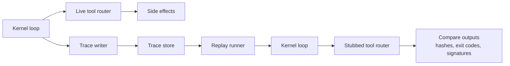

# Replayable Trace Runs

## Context

Traces are most valuable when they are not just “what happened,” but also “something you can replay.” In autonomous-kernel systems, runs often fail in ways that are hard to reproduce: nondeterministic tool outputs, shifting dependencies, or missing context about what the model saw.

Replayable trace runs extend the evaluation-and-traces discipline: a trace is treated as an executable record. Given a trace and a pinned environment, you can rerun the same sequence of steps (or a safe approximation) and verify that outcomes match.

## Problem

How do you make debugging and drift analysis reliable when a run’s behavior depends on many moving parts (repo state, tools, prompts, budgets, and external systems)?

Without replay:

- Incident review is guesswork.
- Regression testing for the harness is weak because you cannot deterministically re-execute past failures.
- “It worked yesterday” is not actionable.

## Forces

- **Determinism vs. reality**: real runs include nondeterministic elements; replay wants determinism.
- **Side effects**: replaying a run must not re-trigger unsafe mutations.
- **Completeness vs. size**: capturing everything makes traces huge; capturing too little makes replay impossible.
- **Version drift**: tools and policies change; replay must record versions or provide compatibility shims.
- **Privacy**: traces can contain sensitive outputs; replay storage must support redaction.

## Solution

Treat a trace as a sequence of typed events with enough information to support a “replay mode.” In replay mode:

- Tool calls are stubbed from recorded results (safe and deterministic).
- Verification commands can be rerun in a pinned environment (where possible).
- Outcomes are compared against recorded evidence (diff hashes, exit codes, normalized errors).

A diagram helps because it distinguishes a live run (real tool router) from replay (stubbed tool router) while sharing the same kernel logic.



## Implementation sketch

Trace event requirements:

- `event_id`, `step`, `timestamp`
- `action`: typed tool call or stop, including tool name and args
- `result`: tool exit status, normalized error, and bounded outputs
- `side_effect_summary`: changed files, created ids/urls, or “none”
- `environment`: repo SHA, harness version, tool versions

Example event (conceptual):

```json
{
  "step": 4,
  "action": {"type": "tool", "tool": "run_tests", "args": {"command": "pytest -q"}},
  "result": {"exit_code": 1, "stderr_excerpt": "E AssertionError: ..."},
  "normalized_error": {"kind": "validation", "signature_id": "sha256:..."},
  "environment": {"repo_sha": "...", "python": "3.12.2"}
}
```

Replay modes (practical):

- **Strict replay (stub tools)**: tools return recorded outputs; the kernel must produce the same next actions and stop reason.
- **Hybrid replay (rerun verifiers)**: rerun verification commands in a pinned environment, but keep side-effectful tools stubbed.
- **Dry-run replay**: do not apply patches; verify that the trace is internally consistent and the evidence bundle can be reconstructed.

Core comparisons that make replay useful:

- Patch identity: compare diff hash (or file checksums).
- Verification: compare exit codes and normalized failure signatures.
- Control flow: compare step count and stop reason distribution.

## Concrete examples

### Example 1: Incident reproduction for a flaky check

A nightly job started failing intermittently. The trace shows a timeout in `mkdocs build`.

Replay approach:

- Strict replay stubs tool outputs to confirm the kernel behavior (it correctly classifies the error as `timeout` and stops “blocked” with repro steps).
- Hybrid replay reruns `uv run mkdocs build` in a pinned environment to see whether the timeout reproduces.

Outcome: you can distinguish “harness misclassified” from “real tool flakiness” without re-triggering unrelated mutations.

### Example 2: Regression test for a past bugfix workflow

A bugfix run from last month succeeded after three steps. A new harness release claims to reduce steps.

Replay approach:

- Run strict replay on the historical trace to ensure the harness still reaches `verified` with the same diff hash.
- Compare metrics (steps, gate failures) across harness versions.

Outcome: the trace becomes a reusable unit test for harness changes.

## Failure modes

- **Insufficient capture**: the trace omits tool args or outputs; replay cannot stub deterministically.
  - Mitigation: define a minimum replay contract per tool.
- **Unsafe replay**: replay triggers real side effects (publishes, ticket creation).
  - Mitigation: default replay to stub side-effect tools; require explicit opt-in to “live” mode.
- **Environment mismatch**: repo/tool versions differ; hybrid replay diverges.
  - Mitigation: record versions and provide a container/lockfile-based pinned environment.
- **Replay brittleness**: minor log differences cause false mismatches.
  - Mitigation: compare normalized outputs (hashes, signatures) rather than raw logs.
- **Privacy leakage**: traces contain sensitive stdout/stderr.
  - Mitigation: redaction and bounded capture, same as evidence bundles.

## When not to use

- Tasks dominated by external, non-stubbable systems (payments, production deploys) where safe replay is not feasible.
- Extremely lightweight workflows where trace capture cost exceeds the value.
- Teams without artifact retention discipline; replay depends on keeping traces and bundles available.
