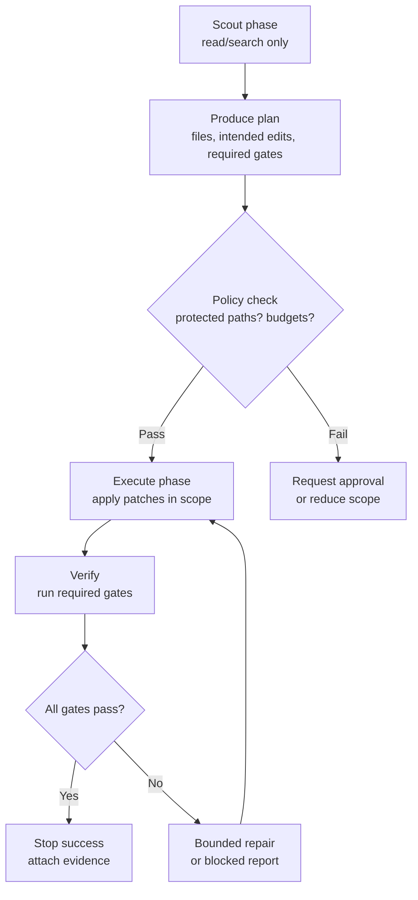

# Scout-Then-Execute (Two-Phase Runs)

## Context

Most failures in autonomous repo work come from acting too early:

- Editing the wrong files because the structure was misread.
- Making a plausible patch that fails on build/test.
- Touching protected surfaces without realizing it.

A harness can reduce this by forcing an explicit read-only discovery phase before any mutations.

## Problem

How do you make autonomous runs reliable and governable when the model’s first guess is often wrong?

You need a structure that:

- Limits side effects until the harness has enough evidence to proceed.
- Produces a concrete plan that can be checked against policy (budgets, protected paths, gates).
- Keeps the run auditable: the trace shows what was discovered and why the next action was safe.

## Forces

- **Speed vs. correctness**: scouting adds a step, but prevents large rework.
- **Context limits**: scouting can bloat context if unconstrained.
- **Staleness**: repository state can change between phases.
- **Tool boundary**: the model must not “accidentally” mutate state during discovery.
- **Evaluation gates**: you want to select checks based on what you find, not on guesswork.

## Solution

Split the run into two explicit phases:

1. **Scout**: read-only exploration that produces a bounded working set, an execution plan, and the required gates.
2. **Execute**: apply patches only within the scoped working set, then run the selected gates and stop only with evidence.

A diagram helps because the key is phase separation. Focus on the hard boundary: Scout cannot call side-effect tools, and Execute cannot change the policy/gates selection without re-scouting.

## Implementation sketch

### Scout phase (read-only)

Constraints:

- Only allow read/search tools.
- Enforce a narrow context budget (for example, max N files opened, max lines).

Outputs:

- **Working set**: explicit list of files to touch.
- **Planned diffs**: high-level description of intended edits (not the patch yet).
- **Gate plan**: required checks selected by a diff-to-gates router policy.
- **Risk assessment**: tier recommendation (see “Risk-Shaped Autonomy Tiers”).
- **Stop conditions**: what evidence is required to declare success.

### Execute phase (mutating)

Constraints:

- Only allow patch tools, and enforce patch locality budgets.
- Reject edits outside the scoped working set unless the run returns to Scout.
- Enforce approvals if protected surfaces are detected.

Verification:

- Run the gates produced in Scout.
- Capture command outputs and exit codes.
- Success requires evidence; otherwise stop as blocked or continue bounded repair.

### Re-scout triggers

Force a return to Scout when:

- The patch touches a file outside the scoped set.
- The diff grows beyond locality budgets.
- A required gate cannot run (missing tool/environment).
- A protected-path rule is encountered.

## Concrete examples

### Example 1: Fix a failing test without touching unrelated code

Scout:

- Run tests to get the failing file and assertion.
- Read only the failing test and the referenced implementation.
- Produce a working set of 2 files and select gates: re-run the single failing test + lint.

Execute:

- Patch only the implementation and test (if needed).
- Re-run the targeted test; stop only when it passes and output is captured.

Result: fewer “fixes” that ripple across the repo because scouting constrained the working set.

### Example 2: Add a new documentation page safely

Scout:

- Inspect existing pattern page structure.
- Confirm the nav structure in the site config.
- Select gates: markdown lint and `mkdocs build`.

Execute:

- Create the new markdown page.
- Update nav (if required by the repo).
- Run `mkdocs build` and stop only on exit code 0.

Result: avoids broken navigation and ensures the site builds.

## Failure modes

- **Scout becomes a full crawl**: the phase reads too much and burns budget.
  - Mitigation: hard cap files/lines; require a selection rationale.
- **Phase leakage**: side effects happen during Scout.
  - Mitigation: enforce tool allowlists in the router/kernel; log rejected tool calls.
- **Execute drift**: patches expand beyond the scoped plan without re-scouting.
  - Mitigation: enforce a working-set contract; violations trigger re-scout.
- **Stale assumptions**: the repo changes between Scout and Execute.
  - Mitigation: record repo SHA or file checksums in Scout; re-scout if changed.
- **Verification skipped**: the run stops success after patching.
  - Mitigation: evidence-first stop gate; success requires gate artifacts.

## When not to use

- Single-file, low-risk edits where the discovery phase adds more overhead than safety.
- Environments where read-only tool access is already expensive (slow repositories, heavy remote calls) and the task risk is low.
- Highly interactive tasks where the right working set is not knowable up front (but even there, you can keep Scout minimal and repeated).
