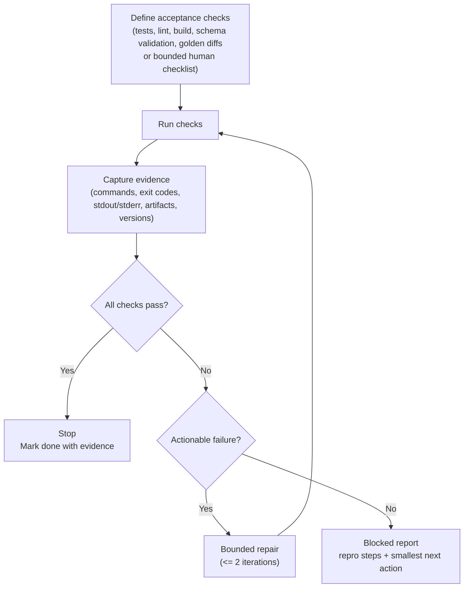

# Self-Verification Loop

## Context

Model outputs often look plausible but can be wrong in subtle ways: incorrect assumptions about repo structure, stale APIs, missing edge cases, or incomplete updates across files. In engineering work, “sounds right” is not an acceptance criterion.

## Problem

How do you force the system to *prove work* against objective checks before it declares completion?

In practice, the problem is that “done” is often treated as a narrative endpoint (“I implemented X”) instead of an evidence-backed claim (“the acceptance checks ran, passed, and the outputs were captured”). A self-verification loop makes the system produce minimal, reviewable evidence: the exact commands (or checklist) used, their outcomes, and artifacts/logs sufficient to reproduce the conclusion.

## Forces

- **Verification cost** must be lower than expected rework cost.
- **Signal alignment**: checks must reflect real acceptance criteria, not proxy metrics.
- **Check gaming**: if checks are narrow, the system may satisfy them while violating intent.
- **Flakiness**: verification tools can fail nondeterministically (network, timing, unstable tests).
- **Side-effect boundaries**: verification should not introduce additional risky mutations.

## Solution

Make verification an explicit, mandatory phase with a stop gate.

A diagram is useful because this is mostly about control flow. The critical details are the stop conditions. Focus on *pass/stop* versus *fail/repair* and *fail/blocked*.

System breakdown (the minimal moving parts):

- **Work**: apply changes to code and docs.
- **Checks**: the acceptance commands or a bounded checklist.
- **Evidence**: captured outputs and artifacts that let a reviewer reproduce the conclusion.
- **Gate**: rules that decide stop, bounded repair, or blocked.
- **Blocked report**: a standardized handoff when the gate cannot be satisfied.



Operationally, this means:

1. **Define acceptance checks** (tests, lint, build, schema validation, golden diffs) and/or a bounded human-review checklist.
2. **Require evidence** in the trace: commands run, outputs captured, and artifacts produced.
3. **Gate completion**: the system may only stop when checks pass, or when it produces a bounded “blocked” report with reproduction steps and the smallest viable next action.

The key behavior change is procedural: “done” becomes a claim that must be backed by artifacts. As the diagram shows, the gate has only three exits: pass/stop, fail with bounded repair, or fail with a blocked report. The evidence component is what makes each exit auditable.

## Implementation sketch

Use a two-part contract per task:

- **Work**: changes made (patches/files) and the intended behavior.
- **Verification**: list of checks and their outcomes, including raw outputs or pointers to captured logs.

A practical default check order is: (1) fast static checks (format/lint), (2) typecheck/build, (3) unit tests, (4) higher-cost integration/e2e and golden diffs. Adjust the list to match the repo’s real acceptance criteria, but keep the ordering biased toward fast failure.

Trade-offs (and how to downshift without skipping the gate):

- **Speed vs confidence**: running only fast checks reduces cycle time, but increases the chance of late failures and rework.
- **Proxy mismatch**: a green lint/build can still violate intent; include at least one behavior check tied to the task’s acceptance criteria.
- **Minimal check set when constrained**: pick one fast static check (lint or format) plus one behavior check (a targeted unit test or a golden diff). Capture evidence for both.

Verification record: required fields (minimum viable):

- **check**: human label for the check.
- **command**: exact command (or checklist name) used.
- **status**: pass/fail/blocked (or equivalent).
- **evidence**: stdout/stderr excerpt or pointer to an attached log/artifact.
- **next_action** (when fail/blocked): smallest change or investigation step.
- **environment** (when flaky/blocked): relevant versions and context (OS, runtime, dependency lock state, network constraints).

Suggested verification record shape:

```yaml
verification:
  - check: "unit tests"
    command: "npm test"
    status: pass
    evidence: "stdout excerpt or attached log"
  - check: "lint"
    command: "npm run lint"
    status: fail
    evidence: "..."
    next_action: "Fix unused import in src/cli.ts"
    environment: "node 20.11.0, macOS 14.3"
```

Practical gating logic:

- If checks pass: stop.
- If checks fail with actionable errors: attempt bounded repair (for example, up to 2 iterations), re-running the same checks and re-capturing evidence each time.
- If failures are environmental/flaky: stop with a “blocked” report and clear reproduction steps.

### Action-class check selection

Verification gets easier to govern when check selection is deterministic.
One practical approach is to derive the minimum check set from an **action class**, then record selection rationale:

- **Read-only**: no verification gates beyond permission/path access; record `skipped_reason: "read_only_action"`.
- **Patch edit**: at least one quality gate (format/lint/typecheck) and one correctness gate (targeted test or golden diff).
- **Dependency change**: include secret scanning for the diff/lockfile and at least one correctness gate that imports/exercises the changed dependency.
- **Release/deploy**: require explicit approval plus a full suite/contract test gate.

If the repo does not have a test runner or the gate is not runnable, treat it as blocked or as an explicit waiver (with recorded risk), not as a pass.

A minimal blocked report template:

- **What failed**: check name + command.
- **What happened**: error excerpt and whether it’s suspected flaky/environmental.
- **How to reproduce**: exact steps, including any required setup.
- **Smallest next action**: one concrete step (e.g., “Pin dependency X to Y”, “Retry with `CI=1`”, “Investigate failing snapshot in file Z”).
- **Environment**: versions and constraints needed to reproduce.

### Concrete example

Task: “Add a new CLI flag and update docs.”

Work:

- Implement parsing for `--format json`.
- Update `README` usage section.

Verification:

- Run unit tests that cover the new flag.
- Run a help-text snapshot (golden file) test.
- Run linter/formatter.

Example evidence-oriented trace snippet:

```text
$ mycli --help
... includes "--format" ...

$ npm test
PASS cli.test.ts (12 tests)

$ npm run lint
0 problems
```

Second example:

Task: “Change default timeout from 10s to 30s and update config docs.”

Work:

- Update default timeout in `src/config.ts`.
- Update `docs/configuration.md` to reflect the new default.

Verification:

- Run a targeted unit test that asserts the default value.
- Run typecheck/build to ensure no downstream breakage.

Example evidence-oriented trace snippet:

```text
$ npm test -- config.test.ts
PASS config.test.ts (5 tests)

$ npm run build
Built in 3.2s

evidence: artifacts/build-log.txt (captured stdout) and updated golden doc diff
```

## Failure modes

- **Rubber-stamp verification**: the system asserts checks passed without running them or without capturing outputs.
- **Proxy mismatch**: checks pass but requirements are unmet (acceptance criteria were incomplete or untested).
- **Check gaming**: tests are modified to match incorrect behavior; the suite becomes less meaningful.
- **Flaky verification loop**: intermittent failures trigger repeated repairs and wasted budget.
- **Over-verification**: too many slow checks push verification out of the critical path and encourage skipping.
- **Unsafe verification**: verification steps include side-effectful actions (publishing, migrations) without approvals.

## When not to use

- Low-impact drafts where verification cost dominates (early outlines, brainstorming, rough notes).
- Environments where checks cannot run (missing tooling or permissions) and no acceptable substitutes exist.
- When checks cannot run but the work must proceed: use an explicit, bounded human-review checklist and capture the rationale and evidence (diff links, screenshots, manual repro steps) in the same “verification” record.
- Tasks where human judgment is the primary signal and objective checks are weak (copy tone, early design exploration).
