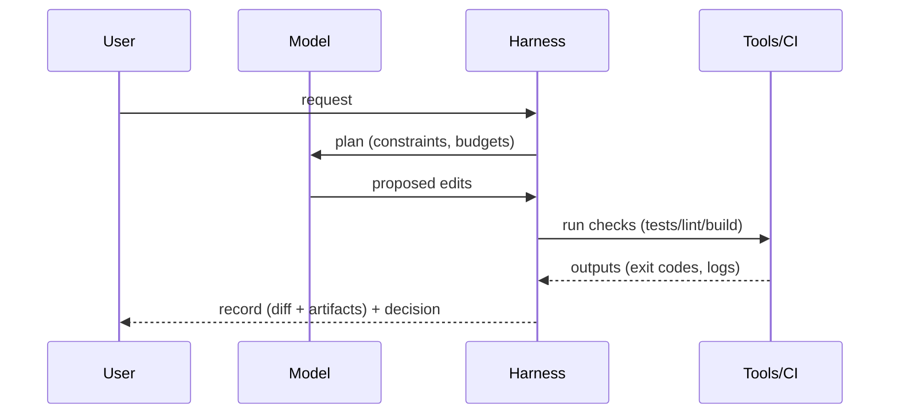

# Preface

This book treats AI-first software engineering as an engineering discipline rather than a product feature.

## Scope

This book focuses on *system design for AI-assisted and agentic development*:

- Harness design: tool contracts, constraints, budgets, evaluation gates, and traces.
- Operational reliability: reproducibility, attribution, rollback, and incident response.
- Governance: permissions, protected surfaces, and enforcement via tooling/CI.
- Memory as an engineered subsystem: provenance, retention, correction, and drift control.

Concrete boundaries:

- **In scope:** a PR review agent that must cite file paths, run linters/tests, and attach logs before approval.
- **In scope:** a code-change workflow that requires a reproducible “plan → change → evaluate → record” trace for each iteration.
- **Out of scope:** model training/fine-tuning, or discussions of model internals beyond what is needed to reason about behavior and failure modes.

What you’ll be able to do after this book:

- Specify tool contracts and evaluation gates so “done” is defined by evidence (tests, builds, checks), not plausibility.
- Design governance boundaries (permissions, protected surfaces) that limit blast radius while keeping workflows productive.
- Make agent loops reproducible and auditable via traces, state, and rollback-friendly change management.

Trade-offs are part of the scope. Stronger gates increase confidence, but they also add latency and maintenance cost. The goal is to make these costs explicit and tunable.

This book does **not** attempt to:

- Train foundation models or discuss model internals beyond what is necessary to reason about system behavior.
- Provide a survey of all agent frameworks; patterns are described in terms of interfaces and invariants.
- Substitute evaluation with plausibility; “done” requires evidence.

## Key distinction: model vs harness

- **Model**: the reasoning component that proposes plans and edits.
- **Harness**: the execution and control environment (tools, policies, evaluation, tracing, state).

The harness turns suggestions into an engineering workflow.
It enforces a small set of invariants:

- Tool access: what tools may be called, with what inputs/outputs (schemas, allowlists, budgets).
- Evidence: what checks must pass before accepting a change (tests, builds, linters, targeted checks).
- Record: what must be stored for audit and rollback (diffs, command output, artifacts, approvals).

Minimal system breakdown (components and interactions):

- **Inputs**: user request, repository state, policy config.
- **Planner**: produces a plan with bounded scope and acceptance criteria.
- **Changer**: proposes a minimal diff that targets the plan.
- **Evaluator**: runs specified commands and collects results as artifacts.
- **Recorder**: writes a trace (plan, diff, commands, outputs, decision).

The diagram below is a literal control flow for request, verification, and recording.

Mini-example: two systems use the same model to “fix failing tests.”
In System A, the model edits files and declares success.
Failures can be missed until later.

In System B, the harness requires three artifacts before “done”:

1. A minimal diff that names the files changed.
2. A test command with exit code 0 (for example: `pytest -q tests/test_auth.py::test_login`).
3. Attached output (command stdout/stderr) linked to the diff.

Acceptance is a gate with an exit code.
If the command is not run, or exits non-zero, the change is rejected.
Acceptance criterion: detection occurs within the same iteration (≤ 1 loop).

Second mini-example: PR review gating.
A review agent may propose “approve.”
Approval is only allowed if:

- The review comment cites at least 3 concrete file paths it inspected.
- The harness runs `ruff check .` and `pytest -q` and records exit code 0 for both.
- The harness attaches the command outputs to the review record.
- If either command is skipped or fails, approval is blocked.

Failure modes still exist, and the harness should surface them explicitly.
Flaky tests can block merges and inflate reruns.
Missing tool coverage can create blind spots for certain file types.
Log omission can hide the true failure cause.
Permission misconfiguration can allow unsafe writes.
In each case, the harness should fail closed and record why.

A recurring hypothesis in the chapters is that many reliability gains are harness-induced. Schema design, verification discipline, and traceability matter even when the model is unchanged.

## What the repository demonstrates

The repository is structured to make book development itself a reproducible agent loop:

- Governance is defined in `CONSTITUTION.md` and `AGENTS.md`.
- Chapter quality, drift signals, and style guardrails are declared in `evals/`.
- Iteration state is recorded in `state/`.

At a high level, each iteration is meant to be verifiable: plan → change → evaluate → record.

Practically, “record” means the repository keeps enough evidence to audit decisions:

- The plan that bounded the edit.
- The minimal diff that implemented it.
- The exact commands executed (including versions and working directory assumptions).
- The outputs needed to verify the result (exit codes, logs, reports).

The intention is to make each chapter a testable unit: clear thesis, system breakdown, concrete examples, trade-offs, failure modes, and research directions.

## How to read

1. Start with the chapter that matches your immediate constraint (evaluation, governance, infra).
2. Use `book/glossary.md` to disambiguate terms.
3. Treat pattern documents in `book/patterns/` as reusable design primitives.
4. If you’re new: read Preface → `book/glossary.md` → one document in `book/patterns/`.
