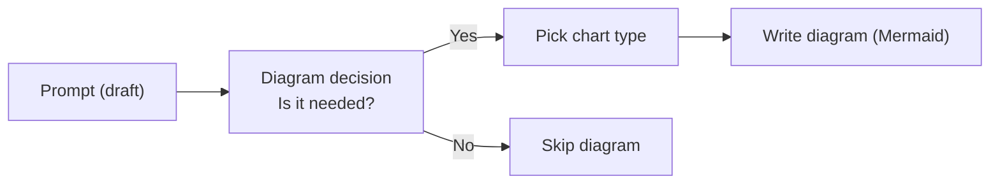
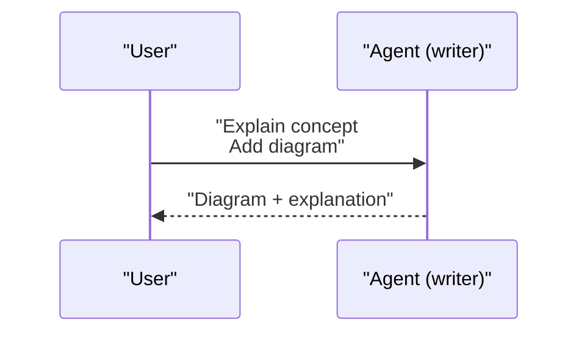
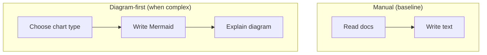

Use Mermaid diagrams when you need to clarify a complex idea, concept, or process. Add a short introduction that explains why a diagram makes sense for the topic and describe what readers should focus on.

• Keep diagrams intentional: pick the simplest mermaid chart that communicates the relationships, flow, or hierarchy you need.
• Label nodes and arrows clearly so readers can follow the reasoning without extra text.
• If the diagram depicts a process, annotate key steps with short captions or highlight decision points.
• When comparing or contrasting ideas, use swimlanes or grids to visually separate the elements.
• For flow and dependency diagrams, arrange layout direction (e.g., LR/TB) to match natural reading order.
• Include a short legend or explanation when you use nonstandard shapes, colors, or styling.

Formatting rules (always follow):

• Use a fenced code block with the Mermaid language tag:
  ```mermaid
  ...
  ```
• Wrap any label that contains parentheses in double quotes. Example: "Build (CI)".
• Use <br/> for explicit new lines inside labels. Example: "Step 1<br/>Step 2".

Remember to keep diagrams consistent with the surrounding prose: mention the diagram before showing it, reference it as you explain the next section, and summarize what readers should take away after they review it.

Examples

1) Simple flow (with parentheses + newline in labels)



2) Sequence diagram (multiline message)



3) Swimlanes-style comparison (subgraphs)


