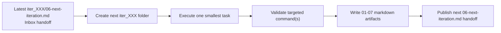

# Feature Improvement Iterations

This folder is the published index for the incremental-improvements orchestration loop.
Each `iter_XXX/` directory captures one completed task, its evidence, and the next inbox handoff.

## Naming

- Iteration folders use `iter_XXX` (zero-padded), such as `iter_148` and `iter_149`.
- Each iteration contains the same seven markdown artifacts:
  - `01-task.md`
  - `02-plan.md`
  - `03-execution.md`
  - `04-validation.md`
  - `05-risks-and-decisions.md`
  - `06-next-iteration.md`
  - `07-summary.md`

## Publishing flow

The latest `06-next-iteration.md` acts as the inbox item for the next run.
The orchestration loop creates the next iteration folder, completes one smallest task, and republishes the next handoff.

## Latest published iteration

- `iter_149`
  - Task: add a short alias smoke mode for the newest long-form exact-once adjacency-order guard assertion.
  - Validation: `python state/copilot_sdk_smoke_test.py --mode usage-examples-duplicate-count-wrapper-helper-newest-long-form-adjacency-order-guard-exact-once-adjacency-order-guard-exact-once`
  - Next inbox handoff: `state/feature_iterations/iter_149/06-next-iteration.md`
